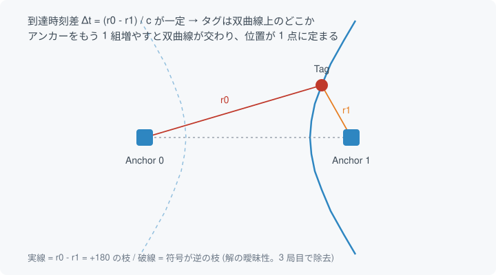
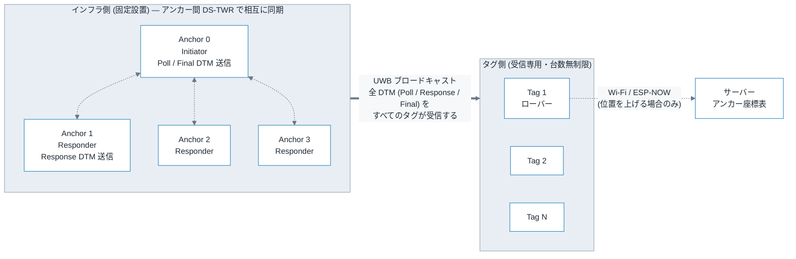
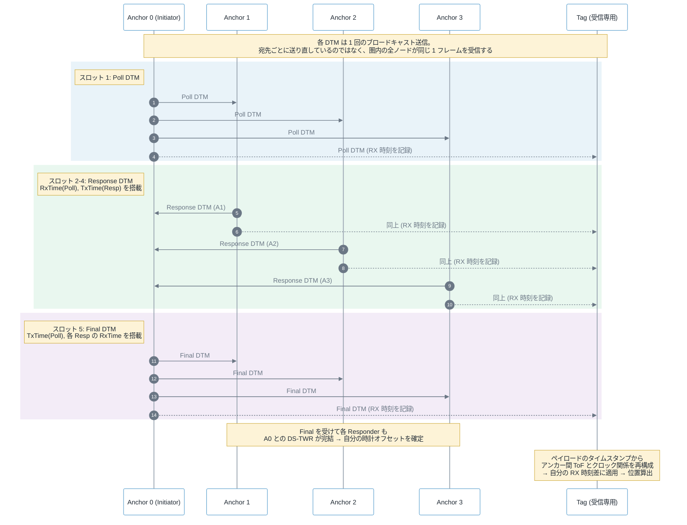
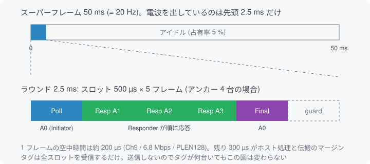
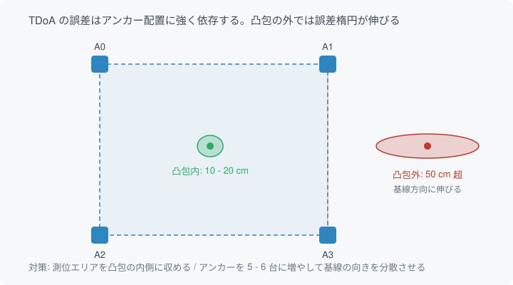
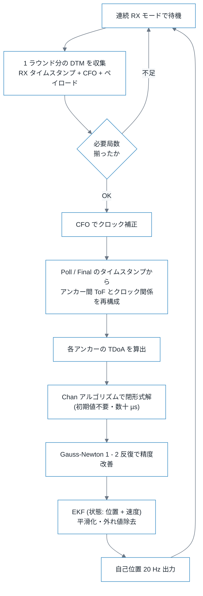

# 下り TDoA (DL-TDoA) 方式 設計メモ

タグを多数収容しながら 20 Hz の自己位置推定を成立させるための、DS-TWR に代わる方式の検討。
対象ハードは Atom S3 / Atom S3 Lite / Atom Lite + M5Stamp-UWB (QM33120W)。

- 作成日: 2026-09-21
- 想定用途: ローバー型ラジコンの自己位置推定 (複数機)
- 現状: タグ 1 台 ⇔ アンカー 1 台の DS-TWR が動作済み
- 関連: [multi-anchor-positioning-design.md](multi-anchor-positioning-design.md)

---

## 1. 背景: DS-TWR 巡回方式の台数の壁

現行の DS-TWR は Poll → Response → Final → Result の 4 フレーム構成で、
タイミングは [src/main.cpp](../src/main.cpp) の `rangeConfig` に設定されている。
1 回の測距に要する時間を積算すると次のようになる。

| 内訳 | 時間 |
| --- | --- |
| Poll 送信 | 0.2 ms |
| `responseTxDelayUus` + Response | 3.0 + 0.2 ms |
| `finalTxDelayUus` + Final | 1.8 + 0.2 ms |
| `resultRxAfterFinalTxDelayUus` + Result | 0.5 + 0.2 ms |
| `resultRepeatCount` 3 回 × `resultRepeatGapMs` 3 ms | 6.4 ms |
| **合計** | **約 12.5 ms** |

収容できるタグ数は次式で決まる。

```text
N_max = 1000 ms / (f × A × T_slot)

  f      = 位置更新レート [Hz]
  A      = 1 回の測位に必要なアンカー数 (2D:3, 3D:4)
  T_slot = 1 回の測距に要する時間
```

f = 20 Hz、A = 3 (2D) で試算すると以下になる。

| 条件 | T_slot | 1 タグあたりの占有 | 収容タグ数 |
| --- | --- | --- | --- |
| 現行設定のまま | 12.5 ms | 750 ms/s | 1 台 (20 Hz 未達の懸念) |
| `resultRepeatCount = 1` | 6.1 ms | 366 ms/s | 2 台 |
| 返信遅延も切り詰め | 3.0 ms | 180 ms/s | 4 - 5 台 |

さらにランダムアクセスのままでは占有率 30 % 付近で衝突が支配的になるため、実力値はこの半分以下。
**DS-TWR 巡回方式では 20 Hz で 2 - 3 台が現実的な上限**であり、台数を伸ばすには方式そのものを変える必要がある。

---

## 2. 下り TDoA の原理

アンカー群が既知位置から測距メッセージを送信し、**タグは受信するだけ**。
各アンカーからの到達時刻の差 (Time Difference of Arrival) が双曲線を描き、その交点がタグ位置になる。



2 局だけでは双曲線上のどこかまでしか絞れないので、局を増やして双曲線を交差させる。

- 2D 測位: TDoA 方程式 2 本が必要 → **アンカー最低 3 台**
- 3D 測位: TDoA 方程式 3 本が必要 → **アンカー最低 4 台**

タグが送信しないことが本方式の核心で、以下が成立する。

- UWB の電波占有はタグ台数に依存しない → **タグ台数は実質無制限**
- 位置更新レートはアンカーのラウンドレートで決まる → ラウンド 20 Hz なら**全タグが同時に 20 Hz**
- タグは受信のみ = 送信電力が不要で低消費電力
- インフラ側はタグの存在を認識しない (プライバシー面で有利)

---

## 3. システム構成



DS-TWR 方式との決定的な違いは矢印の向き。**タグから出る UWB の矢印が 1 本もない**。
測位計算はタグ内で完結する。位置をサーバーへ集約したい場合も UWB は使わず Wi-Fi / ESP-NOW を使う
(UWB で返すと無制限性が壊れる)。

インフラ側の点線は、アンカー間 DS-TWR による同期のやりとり (第 4 節)。
インフラからタグへの太矢印は 1 本にまとめて描いているが、これは
**Poll / Response / Final のすべての DTM が、どのアンカー発であれ、すべてのタグに届く**ことを表す。
各 DTM はブロードキャストで 1 回送信されるだけで、タグの台数が増えても送信回数は変わらない。

---

## 4. ラウンド構成とアンカー間クロック同期

TDoA の本質はアンカー同士がクロックを共有していること。
ただし**有線同期や PTP は不要**で、ラウンド内でアンカー間の DS-TWR を成立させ、
その同期情報をペイロードに載せて配る (FiRa DL-TDoA 方式)。



DTM = Down-link TDoA Message。アンカー 4 台なら **Poll 1 + Response 3 + Final 1 = 5 フレーム**で 1 ラウンド。
アンカー N 台なら N + 1 フレームになる。

### すべてブロードキャスト

シーケンス図では宛先ごとに矢印を引いているが、**実際の送信は各スロットにつき 1 フレームだけ**。
UWB は無線なので、圏内にいるアンカーもタグも同じ 1 フレームを同時に受信する。
矢印の本数はフレーム数ではなく「誰がそれを受け取るか」を表している。

したがって Final DTM も A1 だけでなく **A2 / A3 とすべてのタグが受信する**。
Responder 側にとっての Final は、自分の Response に対する A0 の受信時刻を知って
A0 との DS-TWR を完結させるために必要であり、Responder 全員が受け取らなければ意味がない。

なお Response DTM も物理的には他の Responder に届くが、本設計では使わない
(図では A0 とタグ宛の矢印のみ記載)。

### タグから見た同期

タグは Poll と Final の中身から「A0 が本当はいつ送ったか」「各 Responder の送信時刻が A0 の時計で何時か」を
知ることができる。つまり**同期情報が電波に乗って降ってくる**ので、アンカーを有線で繋ぐ必要がない。

---

## 5. スーパーフレームのタイミング設計



- スーパーフレーム 50 ms (= 20 Hz)
- ラウンド長は 2.5 ms を目標 (スロット 500 µs × 5)
- 1 フレームの空中時間は約 200 µs (Ch9 / 6.8 Mbps / PLEN128)
- 電波占有率は 5 % 程度。レート面の余裕は大きい

### ラウンドを短くしなければならない理由

現行ライブラリのホスト駆動遅延 (1.5 - 3 ms) をそのまま使うとラウンドは 15 ms 前後になる。
レート的には 50 ms に収まるが、**精度面では致命的**。詳細は次節。

スロットを 500 µs まで詰めるには、Responder 側を以下の構成にする。

1. フレームのヘッダ部分を事前に組み立てておく
2. Poll 受信後、`RxTime(Poll)` の 8 バイトだけを SPI 書き込み
3. `dwt_setdelayedtrxtime()` で自スロットの絶対時刻を設定し `dwt_starttx(DWT_START_TX_DELAYED)`

送信時刻はハードウェアが刻むのでホストのジッタは乗らない。
ボトルネックは受信検知から SPI 書き込み完了までの turnaround で、
ステータスレジスタのポーリングなら 300 µs 程度まで詰められる。
現行の 3000 µs は保守的すぎる設定。

---

## 6. 最大の落とし穴: クロックドリフト

タグは 1 ラウンド内で受信した複数フレームの**時刻差**を取る。
ここでタグ自身の水晶のずれがそのまま距離誤差になる。

```text
水晶精度 ±20 ppm、ラウンド長 T のときの時刻差誤差:

  T = 15 ms  →  20ppm × 15ms = 300 ns  →  × 光速 = 90 m   ← 論外
  T = 2.5 ms →  20ppm × 2.5ms = 50 ns  →  × 光速 = 15 m   ← これでも論外
```

無補正では成立しない。対策は 2 つあり、**両方必須**。

### 6.1 ラウンドを詰める

第 5 節の delayed TX によるスロット化。誤差はラウンド長に比例するので、素の効果として 6 倍改善する。

### 6.2 CFO (搬送波周波数オフセット) 補正

`dwt_readclockoffset()` が返す値は、送信側と受信側のクロック比そのもの。
受信フレームごとにこれを読み、タグの時刻差をスケール補正する。

```text
補正後の残差を 0.01 ppm とすると:

  0.01ppm × 2.5ms = 0.025 ns  →  × 光速 = 0.75 cm
```

ここまで落ちて初めて TDoA が実用になる。**CFO 補正の実装は必須項目**であり、後回しにできない。

---

## 7. 誤差予算と幾何感度

| 要因 | 寄与 | 備考 |
| --- | --- | --- |
| タイムスタンプ雑音 | 1 局あたり約 3 cm | 約 100 ps rms。分解能自体は 15.65 ps |
| TDoA の差分演算 | 上記の √2 倍 ≒ 5 cm | 2 局の雑音が合成される |
| クロック残差 | 1 cm 未満 | CFO 補正 + 2.5 ms ラウンド前提 |
| アンカー座標の設置誤差 | そのまま加算 | 実測で追い込む必要あり |
| GDOP (幾何感度) | 凸包外で 2 - 3 倍に膨張 | 下図 |



実力値の目安は以下。

- アンカー凸包の内側: **10 - 20 cm**
- 凸包の外側 (壁際・部屋の隅): **50 cm 超**

DS-TWR の 5 - 10 cm より一段落ちる。これがタグ台数と引き換えのコストになる。

### アンカー台数

最低数は DS-TWR と同じ (2D で 3 台、3D で 4 台) だが、GDOP 劣化分を台数で埋める必要がある。

- 2D: **4 台以上**を推奨
- 3D: **5 - 6 台**を推奨

---

## 8. タグ側の測位計算



- **Chan アルゴリズム**: 双曲線方程式の閉形式解。初期値不要、アンカー 4 台で数十 µs。ESP32 で余裕
- **Gauss-Newton**: Chan の解を初期値にして 1 - 2 反復
- **EKF**: 20 Hz なら状態に速度を含めた等速度モデルで十分。外れ値 (マルチパス) の棄却もここで行う

---

## 9. 現行ライブラリに足りないもの

`M5Stamp_UWB.h` の公開 API には**タイムスタンプが一切現れない**。
`M5Stamp_UWBRxResult` が持つのは `sequence` / `panId` / `src` / `dst` / `payloadLength` / `elapsedMs` などで、
RX タイムスタンプがないため**このままでは TDoA を実装できない**。

一方、Qorvo のドライバ本体はライブラリに同梱されており、必要な関数はすべて揃っている
(`.pio/libdeps/*/M5Stamp_UWB/src/qm33120w_sdk/deca_device_api.h`)。

| 関数 | 用途 |
| --- | --- |
| `dwt_readrxtimestamp()` | 受信タイムスタンプ (40 bit / 15.65 ps) |
| `dwt_readtxtimestamp()` | 送信タイムスタンプ |
| `dwt_setdelayedtrxtime()` | スロット送信の絶対時刻指定 |
| `dwt_setreferencetrxtime()` | 基準時刻の設定 |
| `dwt_readclockoffset()` | CFO 読み出し (クロックドリフト補正) |
| `dwt_readsystimestamphi32()` | 自走時計の読み出し |

`qm33120w_sdk/` は内部ヘッダ扱いなので、`build_flags` に `-I` を追加して直接叩くか、
ラッパー側に `rxTimestamp` / `txTimestamp` / `clockOffset` を返すメソッドを追加するかの二択。
SPI 初期化とドライバインスタンス管理がラッパー側にあるため、**後者のほうが安全**。

---

## 10. 実装ステップ

1. **ラッパーにタイムスタンプ取得を追加**
   `M5Stamp_UWBRxResult` / `M5Stamp_UWBTxResult` に `rxTimestamp` / `txTimestamp` / `clockOffset` を追加する。
   ここが通らないと以降すべてが止まるので最初に着手する。
2. **DTM フレームの定義**
   既存の `frame[0] = 0x41, frame[1] = 0x88` の短アドレスヘッダをそのまま流用し、
   ペイロードに role / roundIndex / slotIndex / タイムスタンプ群を載せる。
3. **アンカーの役割分担**
   Initiator 1 台 + Responder N 台。Responder は Poll 受信時刻から自スロットの絶対時刻を計算し delayed TX。
   スロット番号は `anchorId` からの静的割り当てでよい。
4. **タグの連続 RX ループ**
   1 ラウンド分の DTM を集めてから計算する。送信は一切行わない。
5. **アンカー座標のプロビジョニング**
   NVS またはビルドフラグ。Final DTM に座標を載せてしまえばタグ側の設定が不要になり、立ち上げが楽になる。
6. **CFO 補正と Chan アルゴリズムの実装**
7. **EKF による平滑化**

既存の DS-TWR コードは無駄にならない。DL-TDoA のアンカー間同期部は DS-TWR そのものなので、
`requestDSRange()` / `respondDSRange()` のタイムスタンプ処理をほぼ流用できる。

---

## 11. DS-TWR 方式との比較

| 項目 | DS-TWR 巡回 (現行) | 下り TDoA |
| --- | --- | --- |
| 20 Hz でのタグ台数 | 2 - 3 台 | 実質無制限 |
| 測位精度 | 5 - 10 cm | 10 - 20 cm (凸包内) |
| 凸包外の精度 | 劣化は緩やか | 50 cm 超に劣化 |
| アンカー間クロック同期 | 不要 | 必要 (ただし在圏の電波で自己完結) |
| タグの消費電力 | 送受信 | 受信のみ |
| タグ追加時の作業 | スケジューラの再設計 | 不要 |
| 実装難度 | 実装済み | CFO 補正・スロット制御が必要 |
| 単一障害点 | なし | Initiator アンカー |

---

## 12. 残課題

- **Initiator の冗長化**: Initiator が落ちるとシステム全体が止まる。ローテーション方式の検討
- **スロット 500 µs の実機検証**: ESP32 の turnaround が本当に 300 µs に収まるか要実測。
  Atom Lite は `spi_fast_hz = 8 MHz` に落としているため不利 ([src/main.cpp](../src/main.cpp) 参照)
  - 8MHzに落と差なくても動作したのを確認した。ハンダ不良が原因で動作が不安定だった可能性あり。
- **CFO 補正後の残差の実測**: 0.01 ppm という想定値の妥当性確認
- **マルチパス環境での外れ値率**: 屋内の実測データが必要
- **DS-TWR とのハイブリッド**: 1 局だけ TWR で絶対距離を取り、TDoA の解の曖昧性除去と
  バイアス補正に使う構成も検討の余地あり
