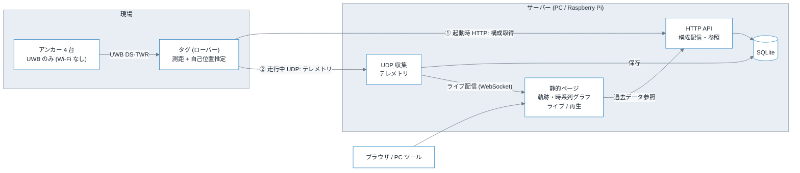

# 測位サーバー 設計メモ

アンカーの ID と設置座標を保持してタグへ配信し、タグから送られてくる測距結果と自己位置推定結果を
蓄積してグラフ可視化するためのサーバーの設計検討。

- 作成日: 2026-09-21
- 想定用途: デバッグ・精度評価。運用系の可用性は要求しない
- 関連: [multi-anchor-positioning-design.md](multi-anchor-positioning-design.md) /
  [downlink-tdoa-design.md](downlink-tdoa-design.md)

---

## 1. サーバーの責務

役割は次の 3 つに分かれる。1 プロセスにまとめるが、内部では層を分けておく。

| 層 | 責務 |
| --- | --- |
| 構成配信 (config) | アンカー ID・設置座標・バイアス補正値をタグへ配る。書き換えは管理 API と self-survey の結果投入 |
| テレメトリ収集 (ingest) | タグから送られる測距結果と推定位置を受け取り、データベースへ書き込む |
| 参照・可視化 (query/viz) | 受信中のデータを WebSocket でライブ配信し、蓄積データは時系列と軌跡として返す。ブラウザで描画する |

デバッグ用途なので、測位計算そのものはサーバーへ持ち込まない。
[multi-anchor-positioning-design.md](multi-anchor-positioning-design.md) の方針どおり**測位はタグ側で完結**させ、
サーバーは「何が届いて、タグが何を出したか」を記録するだけに留める。
サーバーが落ちてもローバーは走り続けられる構成を保つ。

---

## 2. 全体構成



- 構成取得は起動時の 1 回だけなので HTTP で確実に取る。失敗時は NVS キャッシュへフォールバックする
- テレメトリは落ちても測位に影響しないので UDP で投げっぱなしにする。再送もハンドシェイクも行わない
- self-survey (将来) の結果は PC 上の Python スクリプトから管理 API で投入する

### 2.1 なぜテレメトリを UDP にするか

[multi-anchor-positioning-design.md](multi-anchor-positioning-design.md) の 7.4 で指摘したとおり、
Wi-Fi タスクが UWB の待機ループを阻害して測位レートを落とす懸念がある。TCP/HTTP は
接続確立・再送・ACK 待ちでタグ側の処理時間が読めなくなるため、測位ループと相性が悪い。

UDP なら `sendto()` がソケットバッファへコピーして即座に戻るため、タグ側の停止時間が最小で予測しやすい。
パケットが落ちればそのサイクルのグラフに穴が空くだけで、測位そのものには影響しない。
デバッグ用途では欠測を許容できる。

---

## 3. 技術選定

| 要素 | 採用 | 理由 |
| --- | --- | --- |
| 言語・フレームワーク | Python 3.14 + FastAPI + uvicorn | self-survey の MDS / `scipy` と同じ言語に揃う。座標を扱う処理を共有できる |
| データベース | SQLite (WAL モード) | 単一プロセス・単一ライターで足りる。ファイル 1 個なので実験ごとの保存・持ち出しが容易 |
| UDP 収集 | `asyncio.DatagramProtocol` (同一プロセス) | 別プロセスにするほどの負荷がない。DB 接続を 1 本に保てる |
| ライブ配信 | WebSocket (FastAPI 標準) | 走行中のリアルタイム描画を初版から行う。購読タグの切り替えも同じ接続で送る |
| 可視化 | 自前の静的ページ (uPlot + Canvas) | 軌跡 (XY) と時系列を 1 画面に並べたい。Grafana では XY 軌跡が扱いにくい |

### 3.1 データ量の見積もり

最悪ケースとして 20 Hz × タグ 4 台 × アンカー 4 台を想定する。

- 測距レコード: 20 × 4 × 4 = 320 行/秒
- 測位レコード: 20 × 4 = 80 行/秒
- 1 行 40 バイト前後として約 16 KB/秒 ≈ 58 MB/時

SQLite の書き込み能力 (WAL + トランザクション一括コミットで数万行/秒) から見て余裕がある。
1 時間の走行試験で 60 MB 程度なので、実験単位でファイルを分けておけば管理もできる。
これを超える規模になったら PostgreSQL + TimescaleDB へ移す。

### 3.2 可視化を Grafana にしない理由

Grafana は時系列ダッシュボードとしては優秀だが、本用途の主役は
**アンカー 4 点とローバー軌跡を同じ平面に重ねた XY プロット**である。
Grafana の XY Chart パネルでは、アンカー位置の重ね描き・時刻スライダー・軌跡の色による時間表現が作りにくい。

自前ページなら以下を 1 画面に収められる。

- XY 平面: アンカー位置 (固定マーカー)、推定軌跡 (時刻で色付け)、選択時刻の測距円
- 時系列: アンカーごとの距離、成功率、`elapsed_ms`、1 周期の所要時間
- 統計: セッション単位の成功率、欠測率、残差 RMS

ライブ表示を初版から作る点も自前ページに寄せる理由になる。Grafana の自動更新は
データソースへの定期問い合わせなので、サーバーから押し出す WebSocket に比べて遅延が読みにくい。

ダッシュボードの数が増えて自前ページの保守が重くなったら、PostgreSQL へ移行したうえで Grafana を併用する。

### 3.3 プロトコルと message queue の要否

既製のメッセージングミドルウェア (MQTT / NATS / Zenoh / DDS など) は初版では使わない。
理由と、どうなったら導入するかをここに残す。

#### 独自プロトコルで持っているもの / 意図的に持たないもの

6 節のパケット形式が本システムのプロトコルである。含めた要素は次のとおり。

- `magic` + `version`: 異種パケットの排除とフォーマットのバージョン識別
- `boot_id`: セッション識別 (タグの再起動検出)
- `seq`: 欠測検出

逆に **ack・再送・順序保証・ハンドシェイクは意図的に持たない**。
再送機構を入れると送信側の停止時間が予測できなくなり、7.1 でコア分離までして守ろうとしている
測位ループの時間予算が崩れる。デバッグ用テレメトリにとって、欠測は再送の遅延より安い。

#### キュー自体は既にある

6.3 の「メモリ上のキューへ積んで一括 `INSERT`」がキューそのものである。
論点は「キューが要るか」ではなく、**それをプロセス外へ出す必要があるか**に絞られる。

プロセス外のブローカーで初めて手に入るのは次の 3 つ。

| 得られるもの | 本システムでの必要性 |
| --- | --- |
| 複数プロセス・複数マシンへのファンアウト | 現状は 1 プロセスで完結。ブラウザへの配信は既に WebSocket が担っている |
| 再起動をまたぐ永続化 | SQLite が担当。デバッグデータなので取りこぼしも許容する |
| トピックによる購読者側のフィルタ | 購読対象はタグ 1 台程度。WebSocket の `subscribe` で足りる |

負荷面でも理由にならない。タグ 4 台・20 Hz・4 サイクル束ねで 20 パケット/秒、約 4.3 KB/s しかない。

**5.6 の WebSocket が実質的なファンアウト機構になっている点が大きい。**
別プロセスがストリームを欲しくなっても、まず WebSocket を叩けば済む。

#### 候補を採らない理由

| 候補 | ESP32 側 | 採らない理由 |
| --- | --- | --- |
| MQTT (mosquitto) | ライブラリ多数。実績十分 | TCP 前提。QoS 0 でも下位で再送が起き、`publish()` が詰まる。UDP を選んだ理由を打ち消す |
| NATS | 実用的なクライアントが無い | サーバー側の中継にしか使えない。その用途なら WebSocket で足りている |
| Zenoh | `zenoh-pico` が ESP32 対応 | 3 候補中もっとも筋が良い。ただし現状は得るものが無い (下記) |
| Fast DDS | 非対応。MCU 側は Micro XRCE-DDS + Agent | Wi-Fi とマルチキャスト探索の相性が悪い。ROS 2 を使わないなら設定コストだけが残る |
| ZeroMQ / Redis Streams | 実質非対応 | サーバー側専用。ブローカーレス以外の利点が本用途に無い |

#### Zenoh と Fast DDS の評価

この 2 つは「単なるブローカー」ではないので個別に見る。

Zenoh の利点は本システムの形とよく合う。

- `zenoh-pico` が ESP32 を対象にしており、**タグ自身がプロトコルを話せる**。
  この点で NATS や Fast DDS とは土俵が違う
- クライアントモードで UDP を選べるので、MQTT のような TCP 由来の詰まりを避けられる
- pub/sub に加えて query と storage を持つため、**テレメトリ配信・構成配信・履歴参照を 1 つの
  プロトコルに統一できる**。5 節の HTTP と 6 節の UDP を分けている構成を畳める
- REST プラグインがあるのでブラウザからも読める
- 後で ROS 2 と繋ぐ場合も `zenoh-bridge-ros2dds` がある

それでも初版で採らないのは、**統一して減るのが実装ではなく概念の数だから**である。
今の構成は HTTP 1 エンドポイントと UDP 1 ソケットで、どちらも標準ライブラリだけで書ける。
Zenoh に寄せると、依存関係とルータープロセスが増えたうえで、書くコード量はほとんど変わらない。
`zenoh-pico` を ESP32 + 測位ループに載せたときの停止時間も未検証で、
7.1 で潰したはずの不確定要素が戻ってくる。

Fast DDS は QoS の語彙 (best-effort + keep-last(1)、deadline、liveliness) が本用途の意味論と
正確に一致する点が優れている。捨ててよいデータを捨てる設定が、こちらで書かずに宣言で済む。
しかし採用しない理由が構造的にある。

- ESP32 では動かない。MCU 側は Micro XRCE-DDS (micro-ROS) となり、**Agent プロセスの中継が必須**になる。
  タグ → Agent → DDS という経路が増え、遅延の見積もり (8.3) が読みにくくなる
- RTPS の既定の探索が UDP マルチキャストに依存する。**Wi-Fi のマルチキャストは最低レートで送られ、
  AP によっては抑制・変換される**。走行中のローバーが相手では、探索の不安定さが直接効く
- XML プロファイルによる設定量が、得られるものに対して大きい

ROS 2 を使う予定が確定していないうちは、DDS 系を持ち込む理由が無い。

#### 導入を検討する条件

次のいずれかが起きたら再検討する。

1. 収集サーバーとは別プロセス・別マシンでストリームを購読したくなった (FC 側、ROS 2、外部の解析基盤)
2. タグが 10 台を超え、受信プロセスを分けて水平に並べたくなった
3. 同じストリームを他システムへ常時流す要件が出た

そのときの選択は動機で変わる。

- **FC や ROS 2 との統合が動機なら Zenoh**。`zenoh-pico` でタグ側も統一でき、
  ROS 2 へは既製のブリッジで繋がる。Fast DDS を直接使うより経路が短い
- **サーバー側で 1 段ファンアウトしたいだけなら NATS**。単一バイナリで運用が軽く、
  スキーマも探索設定も要らない
- どちらの場合も、まず「WebSocket を購読する 30 行のクライアント」で足りないかを確認する

#### 独自プロトコルの実損

既製品を使わないことで確実に失うのは**デバッグの手軽さ**である。
MQTT なら `mosquitto_sub` で中身が即見えるが、生の UDP バイナリは自前のダンパが要る。

そのため `tools/dump_udp.py` (受信してデコードし 1 行ずつ表示する) を最初から用意する。
これが無いと、タグ側の実装中にパケットの中身を確認する手段が無くなる。

---

## 4. データモデル

座標は SI 単位のメートルを正とするが、**配線上とデータベース内部は整数ミリメートル**で統一する。
浮動小数の丸め差で「同じ値のはずが一致しない」事故を避けるためで、API の JSON でのみメートルに変換する。

座標系は [multi-anchor-positioning-design.md](multi-anchor-positioning-design.md) の 3.2 に従う。
アンカー 0 を原点、アンカー 0→1 方向を +X、Z は鉛直上向きの右手系とする。

### 4.1 テーブル定義

```sql
-- アンカーの ID と設置座標。id はそのまま UWB の responderAddress (0x0100..0xFFFE)
CREATE TABLE anchor (
    id          INTEGER PRIMARY KEY,   -- 0x0100..0xFFFE
    label       TEXT,                  -- 現場での呼び名 ("北西の柱" 等)
    x_mm        INTEGER NOT NULL,
    y_mm        INTEGER NOT NULL,
    z_mm        INTEGER NOT NULL,
    enabled     INTEGER NOT NULL DEFAULT 1,
    source      TEXT NOT NULL,         -- 'manual' | 'survey'
    updated_at  TEXT NOT NULL
);

-- 構成全体のリビジョン。タグはこの値でキャッシュの有効性を判断する
CREATE TABLE config_meta (
    rev              INTEGER PRIMARY KEY,   -- 単調増加。構成を書き換えるたびに +1
    pan_id           INTEGER NOT NULL,      -- 0xDECA
    bias_mm          INTEGER NOT NULL,      -- 全測距へ加算する共通オフセット (self-survey の b)
    telemetry_host   TEXT NOT NULL,         -- テレメトリ送信先 IP。5.1 の telemetry.host
    telemetry_port   INTEGER NOT NULL,      -- 0 ならタグはテレメトリ送信を停止する
    batch_cycles     INTEGER NOT NULL,      -- 1 パケットに詰めるサイクル数
    note             TEXT,
    created_at       TEXT NOT NULL
);

-- リビジョンごとのアンカー座標スナップショット。anchor 表は現在値だけを持つため、
-- 過去のセッションが使った座標表はこちらから復元する
CREATE TABLE config_anchor (
    rev         INTEGER NOT NULL REFERENCES config_meta(rev),
    id          INTEGER NOT NULL,      -- anchor.id と同じ responderAddress
    label       TEXT,
    x_mm        INTEGER NOT NULL,
    y_mm        INTEGER NOT NULL,
    z_mm        INTEGER NOT NULL,
    enabled     INTEGER NOT NULL,
    source      TEXT NOT NULL,
    PRIMARY KEY (rev, id)
) WITHOUT ROWID;

-- タグの 1 回の起動 = 1 セッション。millis() の基準がここで切れる
CREATE TABLE session (
    id            INTEGER PRIMARY KEY AUTOINCREMENT,
    tag_id        INTEGER NOT NULL,    -- 0x0001..0x00FF
    boot_id       INTEGER NOT NULL,    -- タグが起動時に生成する 32bit 乱数
    config_rev    INTEGER,             -- そのセッションが使った構成リビジョン
    fw_version    TEXT,
    started_at    TEXT NOT NULL,       -- サーバー側の壁時計
    last_seen_at  TEXT NOT NULL,
    note          TEXT,                -- 実験条件のメモ (後から付与)
    UNIQUE (tag_id, boot_id)
);

-- 測距 1 本ぶん。1 サイクルにつきアンカー台数だけ行が入る
CREATE TABLE range_sample (
    session_id   INTEGER NOT NULL REFERENCES session(id),
    seq          INTEGER NOT NULL,     -- サイクル通番 (セッション内で単調増加)
    t_tag_ms     INTEGER NOT NULL,     -- タグの millis()
    anchor_id    INTEGER NOT NULL,
    status       INTEGER NOT NULL,     -- 0 = OK、それ以外はライブラリのエラーコード
    distance_mm  INTEGER,              -- status = 0 のときのみ有効
    elapsed_ms   INTEGER,
    PRIMARY KEY (session_id, seq, anchor_id)
) WITHOUT ROWID;

-- そのサイクルでタグが出した自己位置
CREATE TABLE position_fix (
    session_id    INTEGER NOT NULL REFERENCES session(id),
    seq           INTEGER NOT NULL,
    t_tag_ms      INTEGER NOT NULL,
    recv_at       TEXT NOT NULL,       -- サーバー受信時刻 (壁時計)
    ok            INTEGER NOT NULL,    -- 測位が成立したか
    x_mm          INTEGER,
    y_mm          INTEGER,
    z_mm          INTEGER,
    used_count    INTEGER,             -- 解に使ったアンカー数
    residual_mm   INTEGER,             -- 最小二乗の残差 RMS
    method        TEXT,                -- 'trilat2d' | 'trilat3d' | 'tdoa2d' ...
    PRIMARY KEY (session_id, seq)
) WITHOUT ROWID;

CREATE INDEX idx_range_anchor ON range_sample (session_id, anchor_id, seq);
CREATE INDEX idx_fix_time     ON position_fix (session_id, t_tag_ms);
```

### 4.2 設計上のポイント

#### 測距と測位を別テーブルに分ける

1 サイクルで 1 個の位置と N 本の測距が出るため、1 テーブルに詰めると NULL 列だらけになる。
`(session_id, seq)` で結合できるようにしておけば、「どの測距からこの位置が出たか」を辿れる。
デバッグの主目的はまさにこの対応付けなので、分けておく価値がある。

#### セッションで時刻を区切る

タグに RTC はなく、送れる時刻は `millis()` (起動からの経過ミリ秒) だけである。
再起動すると 0 に戻るので、`millis()` だけでは時系列が巻き戻る。

そこで**タグは起動時に 32bit 乱数 `boot_id` を生成**し、全パケットに載せる。
サーバーは `(tag_id, boot_id)` の組で 1 セッションを識別し、セッション開始時のサーバー壁時計を記録する。
絶対時刻が必要な場面では `started_at + t_tag_ms` で近似する。

この近似には Wi-Fi の遅延ゆらぎとクロックドリフトが乗るが、
グラフの横軸としては十分である。厳密な絶対時刻が必要になったら NTP をタグへ入れる。

#### `seq` は欠測検出に使う

UDP なので落ちる。`seq` が連続しているかを見れば、どれだけ落としたかがわかる。
サーバーは受信のたびに欠番を数え、セッション単位の欠測率として保持する。

「UWB の測距が失敗した (`status != 0`)」と「パケットが落ちて記録が無い」は原因が全く違う。
`seq` の欠番があれば後者と判別できる。

#### 構成は `anchor` と `config_anchor` の二段で持つ

`anchor` は現在値だけを保持する表で、管理 API (5.3) の `GET` / `PUT` が直接扱う対象である。
これだけでは座標を書き換えた時点で過去の値が消えてしまい、
「このセッションはどの座標表で走ったか」を後から再現できない。

そこで構成を書き換えるたびに、新しい `rev` と同時に**その時点の全アンカーを `config_anchor` へ写す**。
`session.config_rev` から `config_anchor` を引けば、走行当時の座標表をそのまま復元できる。
`anchor` 側は現在値の参照と更新を単純に保つために残す。

`config_meta` には `telemetry_host` / `telemetry_port` / `batch_cycles` も持たせる。
これらをサーバーの起動設定に置くと、値を変えても `rev` が動かないため ETag (5.1) が古いままになり、
タグが NVS キャッシュを使い続けて新しい送信先を受け取れない。
構成の一部として `rev` に載せることで、タグ側のキャッシュ判定を `rev` の比較だけで完結させる。

---

## 5. API 仕様

すべて `/api/v1` 配下。LAN 内利用を前提に認証は掛けないが、書き込み系のみ
共有トークン (`X-Auth-Token` ヘッダ) を任意で有効にできるようにする。

### 5.1 構成配信 (タグが起動時に呼ぶ)

```http
GET /api/v1/config?tag_id=1
If-None-Match: "rev-7"
```

```jsonc
// 200 OK / ETag: "rev-7"
{
  "rev": 7,
  "pan_id": "0xDECA",
  "bias_mm": -35,
  "anchors": [
    { "id": "0x0100", "x": 0.000, "y": 0.000, "z": 1.800 },
    { "id": "0x0101", "x": 5.120, "y": 0.000, "z": 1.800 },
    { "id": "0x0102", "x": 5.080, "y": 4.310, "z": 1.800 },
    { "id": "0x0103", "x": 0.030, "y": 4.290, "z": 1.800 }
  ],
  "telemetry": { "host": "192.168.1.10", "port": 47100, "batch_cycles": 4 }
}
```

- `id` が UWB の `responderAddress` そのもの。旧メモ 7.2 にあった `addr` フィールドは廃止する (5.4 参照)
- 構成が変わっていなければ `304 Not Modified` を返す。タグは NVS キャッシュをそのまま使う
- `telemetry` でテレメトリの宛先と 1 パケットに詰めるサイクル数をサーバーから指示する。
  タグのファームを焼き直さずに送信頻度を調整できる。`port` が `0` ならテレメトリ送信を停止する。
  値は `config_meta` が持ち、変更すると `rev` が +1 されるのでタグ側のキャッシュも更新される (4.2 参照)
- 応答は `Content-Length` を付けて 1 レスポンスで返し切る。ESP32 側のパーサを単純に保つため
  チャンク転送は使わない

### 5.2 セッション開始通知

```http
POST /api/v1/hello
{ "tag_id": 1, "boot_id": 2863311530, "fw_version": "tag-2026.09.21", "config_rev": 7 }
```

構成取得の直後に 1 回だけ呼ぶ。サーバーは `session` 行を作り、`started_at` を記録する。
これに失敗してもタグは走行を続けてよい。サーバー側は UDP パケットを最初に受けた時点で
セッションを自動生成する (`fw_version` が埋まらないだけ)。

### 5.3 管理 API

| メソッド | パス | 用途 |
| --- | --- | --- |
| `GET` | `/api/v1/anchors` | アンカー一覧 |
| `PUT` | `/api/v1/anchors/{id}` | 1 台の座標を更新。`rev` が +1 される |
| `POST` | `/api/v1/anchors:bulk` | 全台まとめて置換。self-survey の結果投入に使う |
| `PUT` | `/api/v1/config/bias` | バイアス補正値の更新 |
| `PUT` | `/api/v1/config/telemetry` | テレメトリ送信先と `batch_cycles` の更新。`rev` が +1 される |
| `GET` | `/api/v1/config/revisions/{rev}` | 過去のリビジョン時点の構成を返す |
| `GET` | `/api/v1/sessions` | セッション一覧 (成功率・欠測率つき) |
| `PATCH` | `/api/v1/sessions/{id}` | 実験条件のメモを付与 |
| `DELETE` | `/api/v1/sessions/{id}` | セッションとその測定データを削除 |

フェーズ A で実装するのは `GET`/`PUT` anchors、`PUT /api/v1/config/telemetry`、
`GET /api/v1/config/revisions/{rev}` の 4 つである。残りは後続フェーズで足す。

構成を書き換える操作は必ず `config_meta` に新しい `rev` を追加し、同時にその時点の全アンカーを
`config_anchor` へ写す。古い `rev` の行は残すので、
「このセッションはどの座標表で走ったか」を後から再現できる。
座標を直したら過去データの評価がずれる、という事故を防ぐために必要である。

`{id}` は JSON と同じ `0x0100` 形式で指定する。10 進数表記も受け付ける。

### 5.4 ID 表記について

[multi-anchor-positioning-design.md](multi-anchor-positioning-design.md) の 7.2 にあった JSON 例は、
当初 `id` が 0 始まりの通し番号で `addr = 0x0002 + id` という旧方式で書かれていた。
実装済みの採番 (同 2.2) は**アドレスそのものを ID とする** (アンカーは `0x0100..0xFFFE`) ため、
旧メモ側は本メモの 5.1 に合わせて修正済みである。ID とアドレスを分けて持つことはしない。

### 5.5 参照 API (可視化ページが呼ぶ)

```http
GET /api/v1/sessions/{id}/track?from_ms=0&to_ms=60000&max_points=2000
GET /api/v1/sessions/{id}/ranges?anchor_id=0x0100&from_ms=0&to_ms=60000
GET /api/v1/sessions/{id}/summary
```

- `max_points` を超える区間は等間隔に間引いて返す。1 時間ぶんを素で返すとブラウザが固まる
- 列指向 (`{"t":[...], "x":[...], "y":[...]}`) で返す。uPlot がそのまま食える形で、
  行指向 JSON よりも転送量が小さい

### 5.6 ライブ配信 (WebSocket)

```text
WS /api/v1/ws/live
```

接続後、クライアントが購読対象を送る。走行中にタグを切り替えられるよう、
接続を張り直さずに購読を変更できる形にする。

```jsonc
// client -> server
{ "op": "subscribe", "tag_id": 1, "history_ms": 30000 }
{ "op": "unsubscribe" }
```

```jsonc
// server -> client: 購読直後に 1 回だけ、直近 history_ms 分をまとめて送る
{ "type": "snapshot", "session_id": 12, "tag_id": 1, "config_rev": 7,
  "anchors": [ { "id": "0x0100", "x": 0.0, "y": 0.0, "z": 1.8 } ],
  "fix":    { "t": [...], "x": [...], "y": [...], "ok": [...], "used": [...] },
  "ranges": { "0x0100": { "t": [...], "d": [...] } } }

// server -> client: 以降は差分のみ。50 ms ごとにまとめて送る
{ "type": "append", "session_id": 12,
  "fix":    { "t": [...], "x": [...], "y": [...], "ok": [...], "used": [...] },
  "ranges": { "0x0100": { "t": [...], "d": [...] } },
  "lost": 0 }

// server -> client: タグが 3 秒以上途絶えた / 別セッションが始まった
{ "type": "session_end", "session_id": 12, "reason": "timeout" }
{ "type": "session_start", "session_id": 13, "tag_id": 1 }
```

#### snapshot + append にする理由

ページを開いた瞬間から軌跡が見えないと、ライブ表示としては使いにくい。
接続直後に直近 30 秒を一括で渡し、以降は差分だけを流す。
差分のみの設計にすると、接続してから 30 秒待たないとグラフが埋まらない。

#### 送信は 50 ms ごとに束ねる

パケット到着のたびに WebSocket フレームを送ると、タグ 4 台で秒間 20 回の描画要求が飛ぶ。
50 ms (20 Hz) でまとめれば人間の目には十分で、ブラウザ側の再描画も安定する。

#### 追いつけないクライアントは切り捨てる

購読者ごとに上限つきキューを持ち、溢れたら**古いフレームから捨てる**。
ライブ表示で重要なのは最新の状態であって、取りこぼした 1 秒前ではない。
捨てた数は `lost` に入れて通知し、ブラウザ側で「表示が間引かれている」ことがわかるようにする。

溜め込んで順に送ると、遅いクライアントが 1 つあるだけでサーバーのメモリを食い続ける。

#### WebSocket を選ぶ理由

用途としてはサーバーからの一方向配信なので SSE でも足りるが、
購読タグの切り替えと一時停止を同じ接続で送りたいので WebSocket とする。
FastAPI が標準で対応しており、追加の依存も要らない。

---

## 6. テレメトリのパケット形式

### 6.1 方針

1 サイクルごとに 1 パケットを投げると 20 Hz × タグ台数ぶんの送信呼び出しが測位ループへ割り込む。
**複数サイクルをまとめて 1 パケットにする**ことで送信回数を減らす。
`batch_cycles = 4` なら 20 Hz でも送信は 5 Hz になる。

形式はバイナリとする。テキスト (CSV) はデバッグしやすいが、ESP32 側の `snprintf` が
サイクルあたり数百マイクロ秒を食ううえ、パケットが 3 倍近く膨らむ。
受信側は `struct.unpack_from()` で読めるので、サーバー側の実装コストはほとんど変わらない。

### 6.2 フォーマット

すべてリトルエンディアン。パディングは入れず、明示したサイズで詰める。

```text
ヘッダ (24 バイト)
  offset size field      説明
  0      4    magic      'U''W''B''T' (0x54425755)
  4      1    version    = 1
  5      1    flags      bit0: このパケットが最後 (セッション終了) / 他は予約
  6      2    tag_id     0x0001..0x00FF
  8      4    boot_id    起動時に生成した 32bit 乱数
  12     4    seq        先頭サイクルの通番
  16     4    t_tag_ms   先頭サイクルの millis()
  20     1    count      含まれるサイクル数 (1..16)
  21     1    anchor_n   1 サイクルあたりの測距レコード数
  22     2    reserved   0

サイクルレコード (16 バイト + 8 × anchor_n)
  0      2    dt_ms      先頭サイクルからの相対時刻
  2      1    fix_flags  bit0: 測位成功 / bit1: 3D 解
  3      1    used_count 解に使ったアンカー数
  4      4    x_mm       int32
  8      4    y_mm       int32
  12     2    z_mm       int16 (2D 測位では設置高さをそのまま入れる)
  14     2    resid_mm   uint16 (残差 RMS。65535 で飽和)
  ... 以降 anchor_n 個の測距レコード

測距レコード (8 バイト)
  0      2    anchor_id
  2      1    status      0 = OK
  3      1    elapsed_ms  255 で飽和
  4      4    distance_mm int32 (status != 0 のときは 0)
```

アンカー 4 台・4 サイクルで 24 + 4 × (16 + 32) = 216 バイト。MTU に対して十分小さく、
IP フラグメントは起きない。`count = 16` でも 792 バイトに収まる。

`x_mm` / `y_mm` を int32 にしたのは、測位が発散したときに巨大な値が出ても
クリップせずそのまま記録するためである。**発散の様子こそデバッグで見たい情報**なので、
タグ側で値を丸めたり握り潰したりしない。

`z_mm` だけ int16 なのは、2D 測位では固定値であり ±32 m で足りるため。

### 6.3 サーバー側の受信処理

1. `magic` と `version` を検証し、不一致なら破棄してカウンタだけ増やす
2. `(tag_id, boot_id)` からセッションを引く。無ければ作る
3. 展開した行を 2 系統へ流す
   - **保存系**: メモリ上のキューへ積み、100 ms ごとまたは 500 行ごとに 1 トランザクションで `INSERT`
   - **ライブ系**: セッションごとのリングバッファ (直近 60 秒) へ入れ、WebSocket の購読者へ即座に配信
4. どちらか一方が詰まっても他方を止めない

1 パケット 1 トランザクションにすると SQLite の fsync がボトルネックになる。
まとめてコミットすれば秒間数百行は余裕で捌ける。デバッグデータなので、
異常終了時に直近 100 ms を失うことは許容する (WAL + `synchronous = NORMAL`)。

**ライブ配信は DB 書き込みの完了を待たない。** 待つとコミット周期 (100 ms) が
そのまま表示遅延に化けるうえ、DB が詰まった瞬間にライブ表示まで止まる。
受信直後のパース結果をそのまま配るほうが、遅延も障害の波及範囲も小さい。

---

## 7. タグ側の実装方針

サーバー設計に対応してタグ側に必要となる要素を挙げる。実装は別タスクとする。

1. Wi-Fi 接続 → `GET /api/v1/config` → NVS へ保存 (`rev` も一緒に保存する)
2. 取得失敗時は NVS キャッシュを使う。キャッシュも無ければ測位不能として LED で示す
3. `POST /api/v1/hello` を 1 回投げる (失敗は無視)
4. 測位ループ内でサイクル結果をリングバッファへ積み、`batch_cycles` たまったら UDP で送信
5. 送信は**巡回の先頭スロットの直前**に行う。測距と測距の間に割り込ませない

### 7.1 Wi-Fi は常時接続とする (決定)

走行中もテレメトリを送り続けるため、**Wi-Fi は切らない**。
[multi-anchor-positioning-design.md](multi-anchor-positioning-design.md) の 7.4 で候補に挙げていた
「構成取得後に `WiFi.mode(WIFI_OFF)`」は採用しない。

そのうえで、Wi-Fi タスクが測位レートを削らないよう以下を実装する。

#### コア分離

UWB 測距ループを Core 1 に固定する (`xTaskCreatePinnedToCore`)。ESP32-S3 / ESP32-PICO ともデュアルコアで、
Wi-Fi と TCP/IP のタスクは既定で Core 0 に載る。測距の待機ポーリングが Wi-Fi に押しのけられる経路を、
これで構造的に断てる。Atom Lite (classic ESP32) でも同じ構成が使える。

#### 送信タイミングの固定

UDP 送信は**巡回の先頭スロット直前**の 1 か所だけで行う。測距と測距の隙間に非同期で割り込ませない。
`batch_cycles` でまとめることで送信回数そのものを減らす (20 Hz・4 サイクル束ねなら送信は 5 Hz)。

#### Wi-Fi パワーセーブの無効化

`WiFi.setSleep(false)` を設定する。既定のモデムスリープは送信のたびに数十ミリ秒の待ちを生むことがあり、
測位ループから見ると突発的な停止として現れる。ローバーは給電されているので消費電力は問題にならない。

#### 再接続で測位を止めない

AP が落ちる、電波が届かない、といった事態は走行中に必ず起きる。
**再接続処理で測位ループをブロックしない**ことを設計の要件とする。

- `WiFi.reconnect()` を測位ループから呼ばない。接続状態の監視と再接続は Core 0 側の別タスクで行う
- 未接続中は UDP 送信をスキップするだけにする。`sendto()` の失敗は無視してカウンタだけ増やす
- リングバッファは未送信ぶんが溜まったら**古いものから捨てる**。再接続後にまとめて吐き出すと、
  その瞬間に測位ループが止まる。欠測として諦めるほうが正しい

#### 実測して確認する項目

方針は決めたが、影響の大きさは測らないとわからない。

- Wi-Fi 未接続時と接続時で、1 測距の `elapsed_ms` と 1 周期の所要時間がどれだけ変わるか
- UDP 送信を行うサイクルとそうでないサイクルで、所要時間に差が出るか
- AP を意図的に落としたときに、測位レートが維持されるか

許容できない差が出た場合も Wi-Fi を切る方向へは戻さず、`batch_cycles` を増やして送信頻度を下げる、
テレメトリの内容を間引く、といった調整で対処する。

なお、テレメトリの有無で測位レートが変わるなら、**その測定値自体にテレメトリの影響が混ざっている**。
上記の実測は、可視化したデータをどこまで信用してよいかを決めるためにも必要になる。

---

## 8. 可視化ページ

サーバーが `/` で配信する単一ページ。外部ネットワークへ出られない環境でも動くよう、
ライブラリはローカルへ同梱する。

**ライブ表示と再生の両方を初版から作る。** 現場でローバーを走らせながら挙動を見たいので、
記録を後から眺めるだけでは足りない。

### 8.1 画面構成

ライブと再生でパネルの構成は変えない。データの供給元が WebSocket か参照 API かだけが違う。
描画側を 1 つに保てるうえ、ライブで見た画面と後から見返す画面が一致する。

```text
+---------------------------+-----------------------------+
| セッション選択            | サマリ                      |
| [ライブ] / 過去一覧       | 成功率 / 欠測率 / 残差 RMS  |
+---------------------------+-----------------------------+
| XY 軌跡 (Canvas)          | 距離の時系列 (uPlot)        |
|  ・アンカー位置マーカー   |  ・アンカーごとに 1 系列    |
|  ・軌跡 (時刻で色付け)    |  ・失敗は欠測として描画     |
|  ・選択時刻の測距円       +-----------------------------+
|  ・測位失敗点を × で表示  | 周期時間 (uPlot)            |
+---------------------------+-----------------------------+
| 時刻スライダー (再生時) / ライブ + 一時停止 (ライブ時)  |
+---------------------------------------------------------+
```

### 8.2 見るべきもの

デバッグで判断したい内容を先に決めてからパネルを作る。

- **測距円が 1 点で交わらない**: バイアス補正が合っていないか、アンカー座標が間違っている
- **特定のアンカーだけ成功率が低い**: 遮蔽、または設置の向き。時系列で見れば走行位置との相関がわかる
- **軌跡が壁を突き抜ける・飛ぶ**: GDOP の悪い領域に入ったか、可視アンカーが 3 台を切った。
  `used_count` と重ねて表示すれば切り分けられる
- **残差 RMS が走行中だけ大きい**: 同時性誤差
  ([multi-anchor-positioning-design.md](multi-anchor-positioning-design.md) の 5.4) の可能性
- **`seq` の欠番が多い**: Wi-Fi の問題であって測位の問題ではない。混同しないよう別指標で出す

### 8.3 ライブ表示

#### 表示範囲

軌跡は**直近 30 秒のトレイル**とし、古い点から消す。全区間を描き続けると、
長時間走らせたときに点が増え続けて描画が重くなり、直近の動きも見えなくなる。
全区間を見たいときは走行後に再生モードで開く。

#### ライブ中に見たいもの

後から見返すときとは優先順位が違う。ライブでは「今おかしくなっているか」を即座に判断したい。

- 現在位置のマーカーと、現時刻の測距円 (交わり方がその場でわかる)
- アンカーごとの状態ランプ (直近 1 秒の成功率。緑 / 黄 / 赤)
- 直近 1 秒の測位レート [Hz] と欠測率
- 測位失敗が連続した回数

#### 一時停止

ライブ中に「今の挙動」を止めて見たい場面が必ず出る。一時停止ボタンで描画を止め、
裏では受信を続ける。再開すると最新へ追いつく。

停止中に溜めたぶんを再開時に早送り再生することはしない。ライブで見たいのは常に現在の状態である。

#### タグ切断の扱い

3 秒間パケットが来なければ `session_end` を送り、画面には最後の位置をグレーで残す。
軌跡を消さないのは、**止まる直前に何が起きていたかが最も重要**だからである。

#### 遅延の内訳

ライブ表示の遅延はほぼタグ側の束ね待ちで決まる。

| 要因 | 遅延 |
| --- | --- |
| タグ側の `batch_cycles` 束ね (20 Hz・4 サイクル) | 最大 200 ms |
| Wi-Fi + UDP 伝送 | 数 ms |
| サーバーの 50 ms 束ね | 最大 50 ms |
| ブラウザ描画 | 1 フレーム |
| **合計** | **約 250 ms** |

体感で引っかかる場合は `batch_cycles` を 1 - 2 へ下げる。サーバーの構成配信で指示できるので
(5.1 の `telemetry`)、ファームを焼き直さずに調整できる。
ただし送信回数が増えて測位ループへの影響が大きくなるため、7.1 の実測とセットで決める。

---

## 9. 運用

- **配置**: ノート PC か Raspberry Pi 上で uvicorn を 1 プロセス起動する。コンテナ化はしない
- **タグからの到達性**: サーバーの IP をタグの NVS に保存する。
  mDNS (`uwb-server.local`) も検討したが、ESP32 側の解決が不安定なので初版では IP 直指定とする
- **データ保持**: 実験単位で SQLite ファイルを分ける (`data/2026-09-21-run1.db`)。
  自動削除は実装せず、手で消す
- **バックアップ**: ファイルをコピーするだけ。走行試験の記録はそのまま解析の入力になる

---

## 10. 実装ロードマップ

### フェーズ A: 構成配信のみ

- [x] SQLite スキーマと初期マイグレーションを実装
- [x] `GET /api/v1/config` と管理 API (`GET`/`PUT` anchors) を実装
- [x] 座標を手入力する CLI (`tools/anchor_cli.py`) を用意
- [ ] タグ側に Wi-Fi 取得 + NVS キャッシュを実装し、`ANCHOR_IDS[]` の直書きを廃止 (ファーム側リポジトリで行う)

### フェーズ B: テレメトリ収集

- [ ] UDP 受信と一括 INSERT を実装
- [ ] タグ側にリングバッファと UDP 送信を実装
- [ ] UWB 測距ループを Core 1 へ固定し、Wi-Fi 監視・再接続を Core 0 の別タスクへ分離
- [ ] Wi-Fi 常時接続での測位レート影響と、AP 切断時の挙動を実測 (7.1)

### フェーズ C: 可視化 (ライブ + 再生)

- [ ] ライブ用のリングバッファ (直近 60 秒) と WebSocket 配信 (`snapshot` / `append`) を実装
- [ ] 参照 API (`track` / `ranges` / `summary`) を実装
- [ ] XY 軌跡と時系列の単一ページを実装。データ供給元をライブ / 再生で切り替えられるようにする
- [ ] ライブ表示の追加要素 (状態ランプ、直近 1 秒の測位レート、一時停止) を実装
- [ ] 既知座標にローバーを置いた静的試験のデータで、表示が妥当か確認
- [ ] 実際に走らせながらライブ表示の遅延と描画の追従を確認 (8.3 の見積もり 250 ms と照合)

ライブ配信を先に作る。UDP 受信からブラウザまでが繋がっていれば、
タグ側の実装を詰める段階でも画面を見ながらデバッグできるようになる。
参照 API と再生モードはその後で足す。

### フェーズ D: self-survey 連携 (将来)

- [ ] `POST /api/v1/anchors:bulk` で MDS スクリプトの結果を投入
- [ ] バイアス `b` の推定値を `config_meta.bias_mm` へ反映
- [ ] survey の残差をサーバー側に保存し、履歴として比較できるようにする

---

## 11. 未決事項

- タグが複数台になったときの UDP ポート共用 (1 ポートで `tag_id` により振り分ける想定だが未検証)
- 下り TDoA へ移行した場合のデータモデル。タグは測距値ではなく TDoA 値を持つため、
  `range_sample` を `tdoa_sample` として別テーブルにするか、`method` で使い分けるか
- FC (フライトコントローラ) 側の EKF 出力もサーバーへ送るか。
  送るなら `position_fix` に `source` 列を足して UWB 生解と融合解を並べて比較したい
- 絶対時刻の必要性。IMU など他のログと突き合わせる段階になったら NTP の導入を検討する
- ライブ表示で複数タグを同時に描くか (初版は 1 タグ購読。並べて見たくなったら購読を複数へ拡張する)
- ROS 2 / FC 側との統合方式が固まった時点で、Zenoh へ寄せるかを再評価する (3.3)。
  `zenoh-pico` を測位ループと同居させたときの停止時間は、そのとき実測する
