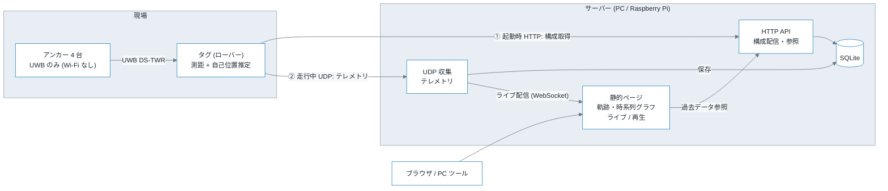

# 測位サーバー 設計メモ

アンカーの ID と設置座標を保持してタグへ配信し、タグから送られてくる測距結果と自己位置推定結果を
蓄積してグラフ可視化するためのサーバーの設計検討。

- 作成日: 2026-09-21
- 想定用途: デバッグ・精度評価。運用系の可用性は要求しない
- 関連: [multi-anchor-positioning-design.md](multi-anchor-positioning-design.md) /
  [downlink-tdoa-design.md](downlink-tdoa-design.md)

---

## 1. サーバーの責務

役割は次の 3 つに分かれる。1 プロセスにまとめるが、内部では層を分けておく。

| 層 | 責務 |
| --- | --- |
| 構成配信 (config) | アンカー ID・設置座標・バイアス補正値をタグへ配る。書き換えは管理 API と self-survey の結果投入 |
| テレメトリ収集 (ingest) | タグから送られる測距結果と推定位置を受け取り、データベースへ書き込む |
| 参照・可視化 (query/viz) | 受信中のデータを WebSocket でライブ配信し、蓄積データは時系列と軌跡として返す。ブラウザで描画する |

デバッグ用途なので、測位計算そのものはサーバーへ持ち込まない。
[multi-anchor-positioning-design.md](multi-anchor-positioning-design.md) の方針どおり**測位はタグ側で完結**させ、
サーバーは「何が届いて、タグが何を出したか」を記録するだけに留める。
サーバーが落ちてもローバーは走り続けられる構成を保つ。

---

## 2. 全体構成


```mermaid
%%{init: {'theme':'base','themeVariables':{'background':'#f6f8fa','primaryColor':'#ffffff','primaryTextColor':'#1f2933','primaryBorderColor':'#2e86c1','mainBkg':'#ffffff','nodeBorder':'#2e86c1','nodeTextColor':'#1f2933','lineColor':'#6b7785','textColor':'#6b7785','edgeLabelBackground':'#f6f8fa','clusterBkg':'#e8eef4','clusterBorder':'#9aa5b1','titleColor':'#1f2933','fontSize':'14px'}}}%%
graph LR
    subgraph FIELD["現場"]
        AN["アンカー 4 台<br/>UWB のみ (Wi-Fi なし)"]
        TAG["タグ (ローバー)<br/>測距 + 自己位置推定"]
        AN -- "UWB DS-TWR" --> TAG
    end
    subgraph SRV["サーバー (PC / Raspberry Pi)"]
        API["HTTP API<br/>構成配信・参照"]
        UDP["UDP 収集<br/>テレメトリ"]
        DB[("SQLite")]
        WEB["静的ページ<br/>軌跡・時系列グラフ<br/>ライブ / 再生"]
        API --> DB
        UDP -- "保存" --> DB
        UDP -- "ライブ配信 (WebSocket)" --> WEB
        WEB -- "過去データ参照" --> API
    end
    TAG -- "① 起動時 HTTP: 構成取得" --> API
    TAG -- "② 走行中 UDP: テレメトリ" --> UDP
    PC["ブラウザ / PC ツール"] --> WEB
```

- 構成取得は起動時の 1 回だけなので HTTP で確実に取る。失敗時は NVS キャッシュへフォールバックする
- テレメトリは落ちても測位に影響しないので UDP で投げっぱなしにする。再送もハンドシェイクも行わない
- self-survey (将来) の結果は PC 上の Python スクリプトから管理 API で投入する

### 2.1 なぜテレメトリを UDP にするか

[multi-anchor-positioning-design.md](multi-anchor-positioning-design.md) の 7.4 で指摘したとおり、
Wi-Fi タスクが UWB の待機ループを阻害して測位レートを落とす懸念がある。TCP/HTTP は
接続確立・再送・ACK 待ちでタグ側の処理時間が読めなくなるため、測位ループと相性が悪い。

UDP なら `sendto()` がソケットバッファへコピーして即座に戻るため、タグ側の停止時間が最小で予測しやすい。
パケットが落ちればそのサイクルのグラフに穴が空くだけで、測位そのものには影響しない。
デバッグ用途では欠測を許容できる。

---

## 3. 技術選定

| 要素 | 採用 | 理由 |
| --- | --- | --- |
| 言語・フレームワーク | Python 3.14 + FastAPI + uvicorn | self-survey の MDS / `scipy` と同じ言語に揃う。座標を扱う処理を共有できる |
| データベース | SQLite (WAL モード) | 単一プロセス・単一ライターで足りる。ファイル 1 個なので実験ごとの保存・持ち出しが容易 |
| UDP 収集 | `asyncio.DatagramProtocol` (同一プロセス) | 別プロセスにするほどの負荷がない。DB 接続を 1 本に保てる |
| ライブ配信 | WebSocket (FastAPI 標準) | 走行中のリアルタイム描画を初版から行う。購読タグの切り替えも同じ接続で送る |
| 可視化 | 自前の静的ページ (uPlot + Canvas) | 軌跡 (XY) と時系列を 1 画面に並べたい。Grafana では XY 軌跡が扱いにくい |

### 3.1 データ量の見積もり

最悪ケースとして 20 Hz × タグ 4 台 × アンカー 4 台を想定する。

- 測距レコード: 20 × 4 × 4 = 320 行/秒
- 測位レコード: 20 × 4 = 80 行/秒
- 1 行 40 バイト前後として約 16 KB/秒 ≈ 58 MB/時

SQLite の書き込み能力 (WAL + トランザクション一括コミットで数万行/秒) から見て余裕がある。
1 時間の走行試験で 60 MB 程度なので、実験単位でファイルを分けておけば管理もできる。
これを超える規模になったら PostgreSQL + TimescaleDB へ移す。

### 3.2 可視化を Grafana にしない理由

Grafana は時系列ダッシュボードとしては優秀だが、本用途の主役は
**アンカー 4 点とローバー軌跡を同じ平面に重ねた XY プロット**である。
Grafana の XY Chart パネルでは、アンカー位置の重ね描き・時刻スライダー・軌跡の色による時間表現が作りにくい。

自前ページなら以下を 1 画面に収められる。

- XY 平面: アンカー位置 (固定マーカー)、推定軌跡 (時刻で色付け)、選択時刻の測距円
- 時系列: アンカーごとの距離、成功率、`elapsed_ms`、1 周期の所要時間
- 統計: セッション単位の成功率、欠測率、残差 RMS

ライブ表示を初版から作る点も自前ページに寄せる理由になる。Grafana の自動更新は
データソースへの定期問い合わせなので、サーバーから押し出す WebSocket に比べて遅延が読みにくい。

ダッシュボードの数が増えて自前ページの保守が重くなったら、PostgreSQL へ移行したうえで Grafana を併用する。

### 3.3 プロトコルと message queue の要否

既製のメッセージングミドルウェア (MQTT / NATS / Zenoh / DDS など) は初版では使わない。
理由と、どうなったら導入するかをここに残す。

#### 独自プロトコルで持っているもの / 意図的に持たないもの

6 節のパケット形式が本システムのプロトコルである。含めた要素は次のとおり。

- `magic` + `version`: 異種パケットの排除とフォーマットのバージョン識別
- `boot_id`: セッション識別 (タグの再起動検出)
- `seq`: 欠測検出

逆に **ack・再送・順序保証・ハンドシェイクは意図的に持たない**。
再送機構を入れると送信側の停止時間が予測できなくなり、7.1 でコア分離までして守ろうとしている
測位ループの時間予算が崩れる。デバッグ用テレメトリにとって、欠測は再送の遅延より安い。

#### キュー自体は既にある

6.3 の「メモリ上のキューへ積んで一括 `INSERT`」がキューそのものである。
論点は「キューが要るか」ではなく、**それをプロセス外へ出す必要があるか**に絞られる。

プロセス外のブローカーで初めて手に入るのは次の 3 つ。

| 得られるもの | 本システムでの必要性 |
| --- | --- |
| 複数プロセス・複数マシンへのファンアウト | 現状は 1 プロセスで完結。ブラウザへの配信は既に WebSocket が担っている |
| 再起動をまたぐ永続化 | SQLite が担当。デバッグデータなので取りこぼしも許容する |
| トピックによる購読者側のフィルタ | 購読対象はタグ 1 台程度。WebSocket の `subscribe` で足りる |

負荷面でも理由にならない。タグ 4 台・20 Hz・4 サイクル束ねで 20 パケット/秒、約 4.3 KB/s しかない。

**5.6 の WebSocket が実質的なファンアウト機構になっている点が大きい。**
別プロセスがストリームを欲しくなっても、まず WebSocket を叩けば済む。

#### 候補を採らない理由

| 候補 | ESP32 側 | 採らない理由 |
| --- | --- | --- |
| MQTT (mosquitto) | ライブラリ多数。実績十分 | TCP 前提。QoS 0 でも下位で再送が起き、`publish()` が詰まる。UDP を選んだ理由を打ち消す |
| NATS | 実用的なクライアントが無い | サーバー側の中継にしか使えない。その用途なら WebSocket で足りている |
| Zenoh | `zenoh-pico` が ESP32 対応 | 3 候補中もっとも筋が良い。ただし現状は得るものが無い (下記) |
| Fast DDS | 非対応。MCU 側は Micro XRCE-DDS + Agent | Wi-Fi とマルチキャスト探索の相性が悪い。ROS 2 を使わないなら設定コストだけが残る |
| ZeroMQ / Redis Streams | 実質非対応 | サーバー側専用。ブローカーレス以外の利点が本用途に無い |

#### Zenoh と Fast DDS の評価

この 2 つは「単なるブローカー」ではないので個別に見る。

Zenoh の利点は本システムの形とよく合う。

- `zenoh-pico` が ESP32 を対象にしており、**タグ自身がプロトコルを話せる**。
  この点で NATS や Fast DDS とは土俵が違う
- クライアントモードで UDP を選べるので、MQTT のような TCP 由来の詰まりを避けられる
- pub/sub に加えて query と storage を持つため、**テレメトリ配信・構成配信・履歴参照を 1 つの
  プロトコルに統一できる**。5 節の HTTP と 6 節の UDP を分けている構成を畳める
- REST プラグインがあるのでブラウザからも読める
- 後で ROS 2 と繋ぐ場合も `zenoh-bridge-ros2dds` がある

それでも初版で採らないのは、**統一して減るのが実装ではなく概念の数だから**である。
今の構成は HTTP 1 エンドポイントと UDP 1 ソケットで、どちらも標準ライブラリだけで書ける。
Zenoh に寄せると、依存関係とルータープロセスが増えたうえで、書くコード量はほとんど変わらない。
`zenoh-pico` を ESP32 + 測位ループに載せたときの停止時間も未検証で、
7.1 で潰したはずの不確定要素が戻ってくる。

Fast DDS は QoS の語彙 (best-effort + keep-last(1)、deadline、liveliness) が本用途の意味論と
正確に一致する点が優れている。捨ててよいデータを捨てる設定が、こちらで書かずに宣言で済む。
しかし採用しない理由が構造的にある。

- ESP32 では動かない。MCU 側は Micro XRCE-DDS (micro-ROS) となり、**Agent プロセスの中継が必須**になる。
  タグ → Agent → DDS という経路が増え、遅延の見積もり (8.3) が読みにくくなる
- RTPS の既定の探索が UDP マルチキャストに依存する。**Wi-Fi のマルチキャストは最低レートで送られ、
  AP によっては抑制・変換される**。走行中のローバーが相手では、探索の不安定さが直接効く
- XML プロファイルによる設定量が、得られるものに対して大きい

ROS 2 を使う予定が確定していないうちは、DDS 系を持ち込む理由が無い。

#### 導入を検討する条件

次のいずれかが起きたら再検討する。

1. 収集サーバーとは別プロセス・別マシンでストリームを購読したくなった (FC 側、ROS 2、外部の解析基盤)
2. タグが 10 台を超え、受信プロセスを分けて水平に並べたくなった
3. 同じストリームを他システムへ常時流す要件が出た

そのときの選択は動機で変わる。

- **FC や ROS 2 との統合が動機なら Zenoh**。`zenoh-pico` でタグ側も統一でき、
  ROS 2 へは既製のブリッジで繋がる。Fast DDS を直接使うより経路が短い
- **サーバー側で 1 段ファンアウトしたいだけなら NATS**。単一バイナリで運用が軽く、
  スキーマも探索設定も要らない
- どちらの場合も、まず「WebSocket を購読する 30 行のクライアント」で足りないかを確認する

#### 独自プロトコルの実損

既製品を使わないことで確実に失うのは**デバッグの手軽さ**である。
MQTT なら `mosquitto_sub` で中身が即見えるが、生の UDP バイナリは自前のダンパが要る。

そのため `tools/dump_udp.py` (受信してデコードし 1 行ずつ表示する) を最初から用意する。
これが無いと、タグ側の実装中にパケットの中身を確認する手段が無くなる。

---

## 4. データモデル

座標は SI 単位のメートルを正とするが、**配線上とデータベース内部は整数ミリメートル**で統一する。
浮動小数の丸め差で「同じ値のはずが一致しない」事故を避けるためで、API の JSON でのみメートルに変換する。

座標系は [multi-anchor-positioning-design.md](multi-anchor-positioning-design.md) の 3.2 に従う。
アンカー 0 を原点、アンカー 0→1 方向を +X、Z は鉛直上向きの右手系とする。

### 4.1 テーブル定義

```sql
-- アンカーの ID と設置座標。id はそのまま UWB の responderAddress (0x0100..0xFFFE)
CREATE TABLE anchor (
    id          INTEGER PRIMARY KEY,   -- 0x0100..0xFFFE
    label       TEXT,                  -- 現場での呼び名 ("北西の柱" 等)
    x_mm        INTEGER NOT NULL,
    y_mm        INTEGER NOT NULL,
    z_mm        INTEGER NOT NULL,
    enabled     INTEGER NOT NULL DEFAULT 1,
    source      TEXT NOT NULL,         -- 'manual' | 'survey'
    updated_at  TEXT NOT NULL
);

-- 構成全体のリビジョン。タグはこの値でキャッシュの有効性を判断する
CREATE TABLE config_meta (
    rev              INTEGER PRIMARY KEY,   -- 単調増加。構成を書き換えるたびに +1
    pan_id           INTEGER NOT NULL,      -- 0xDECA
    bias_mm          INTEGER NOT NULL,      -- 全測距へ加算する共通オフセット (self-survey の b)
    telemetry_host   TEXT NOT NULL,         -- テレメトリ送信先 IP。5.1 の telemetry.host
    telemetry_port   INTEGER NOT NULL,      -- 0 ならタグはテレメトリ送信を停止する
    batch_cycles     INTEGER NOT NULL,      -- 1 パケットに詰めるサイクル数
    note             TEXT,
    created_at       TEXT NOT NULL
);

-- リビジョンごとのアンカー座標スナップショット。anchor 表は現在値だけを持つため、
-- 過去のセッションが使った座標表はこちらから復元する
CREATE TABLE config_anchor (
    rev         INTEGER NOT NULL REFERENCES config_meta(rev),
    id          INTEGER NOT NULL,      -- anchor.id と同じ responderAddress
    label       TEXT,
    x_mm        INTEGER NOT NULL,
    y_mm        INTEGER NOT NULL,
    z_mm        INTEGER NOT NULL,
    enabled     INTEGER NOT NULL,
    source      TEXT NOT NULL,
    PRIMARY KEY (rev, id)
) WITHOUT ROWID;

-- タグの 1 回の起動 = 1 セッション。millis() の基準がここで切れる
CREATE TABLE session (
    id            INTEGER PRIMARY KEY AUTOINCREMENT,
    tag_id        INTEGER NOT NULL,    -- 0x0001..0x00FF
    boot_id       INTEGER NOT NULL,    -- タグが起動時に生成する 32bit 乱数
    config_rev    INTEGER,             -- そのセッションが使った構成リビジョン
    fw_version    TEXT,
    started_at    TEXT NOT NULL,       -- サーバー側の壁時計
    last_seen_at  TEXT NOT NULL,
    note          TEXT,                -- 実験条件のメモ (後から付与)
    UNIQUE (tag_id, boot_id)
);

-- 測距 1 本ぶん。1 サイクルにつきアンカー台数だけ行が入る
CREATE TABLE range_sample (
    session_id   INTEGER NOT NULL REFERENCES session(id),
    seq          INTEGER NOT NULL,     -- サイクル通番 (セッション内で単調増加)
    t_tag_ms     INTEGER NOT NULL,     -- タグの millis()
    anchor_id    INTEGER NOT NULL,
    status       INTEGER NOT NULL,     -- 0 = OK、それ以外はライブラリのエラーコード
    distance_mm  INTEGER,              -- status = 0 のときのみ有効
    elapsed_ms   INTEGER,
    PRIMARY KEY (session_id, seq, anchor_id)
) WITHOUT ROWID;

-- そのサイクルでタグが出した自己位置
CREATE TABLE position_fix (
    session_id    INTEGER NOT NULL REFERENCES session(id),
    seq           INTEGER NOT NULL,
    t_tag_ms      INTEGER NOT NULL,
    recv_at       TEXT NOT NULL,       -- サーバー受信時刻 (壁時計)
    ok            INTEGER NOT NULL,    -- 測位が成立したか
    x_mm          INTEGER,
    y_mm          INTEGER,
    z_mm          INTEGER,
    used_count    INTEGER,             -- 解に使ったアンカー数
    residual_mm   INTEGER,             -- 最小二乗の残差 RMS
    method        TEXT,                -- 'trilat2d' | 'trilat3d' | 'tdoa2d' ...
    -- タグ側のカルマンフィルタ (multi-anchor-positioning-design.md の 3.7)。version 2 のパケットから入る
    kf_ok         INTEGER NOT NULL DEFAULT 0,  -- フィルタ後の位置が有効か
    kf_updated    INTEGER NOT NULL DEFAULT 0,  -- 観測で更新したか (0 なら予測だけ)。kf_ok = 0 なら 0
    kf_init       INTEGER NOT NULL DEFAULT 0,  -- 最小二乗の解で初期化したか。kf_ok = 0 なら 0
    kf_x_mm       INTEGER,             -- フィルタ後の位置。kf_ok = 0 なら NULL
    kf_y_mm       INTEGER,
    kf_z_mm       INTEGER,
    kf_sigma_mm   INTEGER,             -- 位置の標準偏差。kf_ok = 0 なら NULL
    kf_used       INTEGER,             -- フィルタが取り込んだ測距の本数
    kf_rejected   INTEGER,             -- イノベーションの大きさで棄却した測距の本数
    PRIMARY KEY (session_id, seq)
) WITHOUT ROWID;

CREATE INDEX idx_range_anchor ON range_sample (session_id, anchor_id, seq);
CREATE INDEX idx_fix_time     ON position_fix (session_id, t_tag_ms);
```

### 4.2 設計上のポイント

#### 測距と測位を別テーブルに分ける

1 サイクルで 1 個の位置と N 本の測距が出るため、1 テーブルに詰めると NULL 列だらけになる。
`(session_id, seq)` で結合できるようにしておけば、「どの測距からこの位置が出たか」を辿れる。
デバッグの主目的はまさにこの対応付けなので、分けておく価値がある。

#### 最小二乗の解とフィルタ後の位置を同じ行に持つ

タグは 1 サイクルごとに最小二乗の解とフィルタ後の位置を 1 つずつ出すので、どちらも `(session_id, seq)` と
1 対 1 に対応する。表を分けても結合のキーが同じになるだけなので、`position_fix` に `kf_` で始まる列として並べる。
2 つの成否は独立している。最小二乗が解けずにフィルタが予測でつないだサイクルは、`ok = 0` で `x_mm` が NULL、
`kf_ok = 1` で `kf_x_mm` に値が入る。フィルタの比較で見たいのはまさにこうしたサイクルなので、どちらか一方の
成否で行ごと捨てたり、もう一方の値を NULL にしたりしない。

`kf_` の列は 0002 のマイグレーションで足した。それより前のパケット (version 1) で書いた行は `kf_ok = 0` で、
`kf_used` と `kf_rejected` は NULL になる。

#### セッションで時刻を区切る

タグに RTC はなく、送れる時刻は `millis()` (起動からの経過ミリ秒) だけである。
再起動すると 0 に戻るので、`millis()` だけでは時系列が巻き戻る。

そこで**タグは起動時に 32bit 乱数 `boot_id` を生成**し、全パケットに載せる。
サーバーは `(tag_id, boot_id)` の組で 1 セッションを識別し、セッション開始時のサーバー壁時計を記録する。
絶対時刻が必要な場面では `started_at + t_tag_ms` で近似する。

この近似には Wi-Fi の遅延ゆらぎとクロックドリフトが乗るが、
グラフの横軸としては十分である。厳密な絶対時刻が必要になったら NTP をタグへ入れる。

#### `seq` は欠測検出に使う

UDP なので落ちる。`seq` が連続しているかを見れば、どれだけ落としたかがわかる。
サーバーは受信のたびに欠番を数え、セッション単位の欠測率として保持する。

「UWB の測距が失敗した (`status != 0`)」と「パケットが落ちて記録が無い」は原因が全く違う。
`seq` の欠番があれば後者と判別できる。

#### 構成は `anchor` と `config_anchor` の二段で持つ

`anchor` は現在値だけを保持する表で、管理 API (5.3) の `GET` / `PUT` が直接扱う対象である。
これだけでは座標を書き換えた時点で過去の値が消えてしまい、
「このセッションはどの座標表で走ったか」を後から再現できない。

そこで構成を書き換えるたびに、新しい `rev` と同時に**その時点の全アンカーを `config_anchor` へ写す**。
`session.config_rev` から `config_anchor` を引けば、走行当時の座標表をそのまま復元できる。
`anchor` 側は現在値の参照と更新を単純に保つために残す。

`config_meta` には `telemetry_host` / `telemetry_port` / `batch_cycles` も持たせる。
これらをサーバーの起動設定に置くと、値を変えても `rev` が動かないため ETag (5.1) が古いままになり、
タグが NVS キャッシュを使い続けて新しい送信先を受け取れない。
構成の一部として `rev` に載せることで、タグ側のキャッシュ判定を `rev` の比較だけで完結させる。

---

## 5. API 仕様

すべて `/api/v1` 配下。LAN 内利用を前提に認証は掛けないが、書き込み系のみ
共有トークン (`X-Auth-Token` ヘッダ) を任意で有効にできるようにする。

### 5.1 構成配信 (タグが起動時に呼ぶ)

```http
GET /api/v1/config?tag_id=1
If-None-Match: "rev-7"
```

```jsonc
// 200 OK / ETag: "rev-7"
{
  "rev": 7,
  "pan_id": "0xDECA",
  "bias_mm": -35,
  "anchors": [
    { "id": "0x0100", "x": 0.000, "y": 0.000, "z": 1.800 },
    { "id": "0x0101", "x": 5.120, "y": 0.000, "z": 1.800 },
    { "id": "0x0102", "x": 5.080, "y": 4.310, "z": 1.800 },
    { "id": "0x0103", "x": 0.030, "y": 4.290, "z": 1.800 }
  ],
  "telemetry": { "host": "192.168.1.10", "port": 47100, "batch_cycles": 4 }
}
```

- `id` が UWB の `responderAddress` そのもの。旧メモ 7.2 にあった `addr` フィールドは廃止する (5.4 参照)
- 構成が変わっていなければ `304 Not Modified` を返す。タグは NVS キャッシュをそのまま使う
- `telemetry` でテレメトリの宛先と 1 パケットに詰めるサイクル数をサーバーから指示する。
  タグのファームを焼き直さずに送信頻度を調整できる。`port` が `0` ならテレメトリ送信を停止する。
  値は `config_meta` が持ち、変更すると `rev` が +1 されるのでタグ側のキャッシュも更新される (4.2 参照)
- 応答は `Content-Length` を付けて 1 レスポンスで返し切る。ESP32 側のパーサを単純に保つため
  チャンク転送は使わない

### 5.2 セッション開始通知

```http
POST /api/v1/hello
{ "tag_id": 1, "boot_id": 2863311530, "fw_version": "tag-2026.09.21", "config_rev": 7 }
```

構成取得の直後に 1 回だけ呼ぶ。サーバーは `session` 行を作り、`started_at` を記録する。
これに失敗してもタグは走行を続けてよい。サーバー側は UDP パケットを最初に受けた時点で
セッションを自動生成する (`fw_version` が埋まらないだけ)。

UDP が先に届いてセッションができていた場合は、既存の行へ `fw_version` と `config_rev` を書き足す。
hello で省略された項目は、既に記録されている値を消さない。
`started_at` は hello と UDP のどちらか早いほうの受信時刻とする。応答は `{"session_id": 12}` とする。
タグ自身が呼ぶ API であり管理 API ではないので、共有トークン (`X-Auth-Token`) は要求しない。

### 5.3 管理 API

| メソッド | パス | 用途 |
| --- | --- | --- |
| `GET` | `/api/v1/anchors` | アンカー一覧 |
| `PUT` | `/api/v1/anchors/{id}` | 1 台の座標を更新。`rev` が +1 される |
| `POST` | `/api/v1/anchors:bulk` | 全台まとめて置換。self-survey の結果投入に使う |
| `PUT` | `/api/v1/config/bias` | バイアス補正値の更新 |
| `PUT` | `/api/v1/config/telemetry` | テレメトリ送信先と `batch_cycles` の更新。`rev` が +1 される |
| `GET` | `/api/v1/config/revisions/{rev}` | 過去のリビジョン時点の構成を返す |
| `GET` | `/api/v1/sessions` | セッション一覧 (成功率・欠測率つき) |
| `PATCH` | `/api/v1/sessions/{id}` | 実験条件のメモを付与 |
| `DELETE` | `/api/v1/sessions/{id}` | セッションとその測定データを削除 |

フェーズ A で実装するのは `GET`/`PUT` anchors、`PUT /api/v1/config/telemetry`、
`GET /api/v1/config/revisions/{rev}` の 4 つである。可視化ページのセッション選択に使うため、
`GET /api/v1/sessions` はフェーズ C で実装した。残りは後続フェーズで足す。

構成を書き換える操作は必ず `config_meta` に新しい `rev` を追加し、同時にその時点の全アンカーを
`config_anchor` へ写す。古い `rev` の行は残すので、
「このセッションはどの座標表で走ったか」を後から再現できる。
座標を直したら過去データの評価がずれる、という事故を防ぐために必要である。

`{id}` は JSON と同じ `0x0100` 形式で指定する。10 進数表記も受け付ける。

### 5.4 ID 表記について

[multi-anchor-positioning-design.md](multi-anchor-positioning-design.md) の 7.2 にあった JSON 例は、
当初 `id` が 0 始まりの通し番号で `addr = 0x0002 + id` という旧方式で書かれていた。
実装済みの採番 (同 2.2) は**アドレスそのものを ID とする** (アンカーは `0x0100..0xFFFE`) ため、
旧メモ側は本メモの 5.1 に合わせて修正済みである。ID とアドレスを分けて持つことはしない。

### 5.5 参照 API (可視化ページが呼ぶ)

```http
GET /api/v1/sessions/{id}/track?from_ms=0&to_ms=60000&max_points=2000
GET /api/v1/sessions/{id}/ranges?anchor_id=0x0100&from_ms=0&to_ms=60000
GET /api/v1/sessions/{id}/summary
```

- `max_points` を超える区間は等間隔に間引いて返す。1 時間ぶんを素で返すとブラウザが固まる
- 列指向 (`{"t":[...], "x":[...], "y":[...]}`) で返す。uPlot がそのまま食える形で、
  行指向 JSON よりも転送量が小さい

#### 参照 API の取り決め (フェーズ C)

- `from_ms` / `to_ms` は、32 ビットの折り返しを展開したタグの `millis()` で指定し、両端を含む。
  省略すると端を切らない
- `seq` と `t_tag_ms` はパケットでは 32 ビットで折り返す (6.2)。そのまま並べると折り返した後の行が先頭へ来て、
  周期も負になる。そこでセッションごとに展開してから並べる。`seq` は最小値と最大値の差が 2^31 以上なら
  折り返したとみなし、2^31 未満の値に 2^32 を足す (1 セッションが 2^31 サイクル未満であること、30 Hz で
  2 年以上、を前提とする)。`t_tag_ms` は展開した `seq` の順に並べ、直前より 2^31 を超えて小さくなった回数だけ
  2^32 を足す。測距の `seq` / `t` は、測位記録 (`position_fix`) で求めたセッション共通の展開値を `seq` で
  当てる。アンカーごとに展開すると、折り返した後に初めて現れたアンカーだけ 2^32 ずれるためである。
  ライブ配信 (5.6) も直前のサイクルからの差を足して同じ値に展開する。差がちょうど 2^31 の `seq` を先へ進んだと
  みなすこと、時刻は 2^31 を超えて減ったときだけ折り返しとみなすことも含め、境界の扱いを参照 API と同じにする。折り返す前 (起動から
  約 49.7 日) は受信した値そのままである
- ライブ配信の展開は、サーバーのプロセスが受けたパケットだけから行う (ライブ系は DB を読まない)。
  そのため、タグが折り返した後にサーバーだけを再起動すると、ライブ配信はその時点の生の値から数え直し、
  参照 API は DB 全体から展開するので、同じサイクルの `t` / `seq` が 2^32 の倍数だけずれる。
  ずれるのはタグを 49.7 日以上続けて動かし、その途中でサーバーを再起動した場合に限られ、デバッグ用途では
  起こりにくいので制約として受け入れる。ライブ表示は直近 30 秒しか描かず、その中では値が連続しているので、
  描画は崩れない。再生で見返すときは参照 API の値が正となる
- 列の名前と単位はライブ配信 (5.6) の `fix` / `ranges` と同じにする。可視化ページが同じ描画処理で扱えるように
  するためで、組み立ても 1 か所 (`location_server/columns.py`) にまとめる

  | 列 | 内容 |
  | --- | --- |
  | `fix.t` / `fix.seq` | タグの `millis()` [ms] とサイクル通番。どちらも折り返しを展開した値 |
  | `fix.dt` | 直前のサイクル (`seq` が 1 つ前) からの時刻差 [ms]。欠番をまたぐ場合と直前が無い場合は `null` |
  | `fix.x` / `fix.y` / `fix.z` | 推定位置 [m]。測位に失敗したサイクルは `null` |
  | `fix.ok` / `fix.used` / `fix.resid` | 測位の成否、解に使ったアンカー数、残差 RMS [m] |
  | `fix.kx` / `fix.ky` / `fix.kz` | フィルタ後の位置 [m]。フィルタ後の位置が無効なサイクルは `null` |
  | `fix.kok` / `fix.kupd` / `fix.kinit` | フィルタ後の位置の有効、観測で更新したか (`false` なら予測だけ)、最小二乗の解で初期化したか |
  | `fix.ksig` | フィルタ後の位置の標準偏差 [m]。無効なサイクルは `null` |
  | `fix.kused` / `fix.krej` | フィルタが取り込んだ測距と棄却した測距の本数。version 1 のパケットで書いた行は `null` |
  | `ranges.<id>.t` / `.seq` | 測距した時刻とサイクル通番。`<id>` は `0x0100` 形式 |
  | `ranges.<id>.d` | 距離 [m]。失敗 (`st != 0`) は `null`。成功した負の値はそのまま返す |
  | `ranges.<id>.st` / `.el` | status (0 = OK) と `elapsed_ms` |

- 間引きは行番号の剰余で行い、何行おきに取ったか (`stride`) と間引く前の件数 (`total`) を `decimation` に添える。
  末尾の行は必ず含める。そのぶんを見込んで `stride` は `ceil((total - 1) / (max_points - 1))` とするので、
  `max_points` は 2 以上とする。`ranges` の間引きはアンカーごとに行う。`anchor_id` を省略すると全アンカーを返す
- `ranges` の `max_points` はアンカーごとの上限なので、全アンカーを取ると台数ぶん応答が膨らむ (プロトコル上は
  255 台まで持てる)。そこで全アンカー合計に 20,000 点の予算を設け、1 台あたりは `max_points` と予算を台数で割った
  値の小さいほう (最低 2 点) とする。実際の台数 (10 台まで) なら `max_points` がそのまま使われ、`track` と同じ位置で
  間引かれる
- `fix.dt` は間引く前に、セッション全体で隣り合う `seq` どうしから求める。間引いた後で差を取ると
  周期が `stride` 倍に見えるためである
- `summary` はセッション単位の測位成功率・欠測率 (`seq` の欠番)・残差 RMS (測位に成功したサイクルのみ)・
  周期の平均と最大 (欠番をまたぐ差は除く)・`used_count` の範囲と、アンカーごとの成功率・`elapsed_ms`・
  平均距離・status ごとの件数を返す。フィルタについては、位置が有効だったサイクル数、そのうち予測だけでつないだ
  サイクル数、初期化の回数、棄却した測距の合計、標準偏差の平均 (有効なサイクルのみ) を返す。再生画面で XY 平面を描けるよう、そのセッションが使った構成リビジョンの
  アンカー座標 (`anchors`) と、そのリビジョン番号 (`anchors_rev`) も添える。hello が届かず
  `session.config_rev` が空のセッションには現在の構成を返し、`anchors_rev` でそれとわかるようにする
- `GET /api/v1/sessions` は新しい順に `limit` 件 (既定 100) を返し、各セッションの測位成功率と欠測率を添える

### 5.6 ライブ配信 (WebSocket)

```text
WS /api/v1/ws/live
```

接続後、クライアントが購読対象を送る。走行中にタグを切り替えられるよう、
接続を張り直さずに購読を変更できる形にする。

```jsonc
// client -> server
{ "op": "subscribe", "tag_id": 1, "history_ms": 30000 }
{ "op": "unsubscribe" }
```

```jsonc
// server -> client: 購読直後に 1 回だけ、直近 history_ms 分をまとめて送る
{ "type": "snapshot", "session_id": 12, "tag_id": 1, "boot_id": 2863311530, "config_rev": 7,
  "active": true, "history_ms": 30000, "anchors_rev": 7,
  "anchors": [ { "id": "0x0100", "label": "北西の柱", "x": 0.0, "y": 0.0, "z": 1.8 } ],
  "fix":    { "t": [...], "seq": [...], "dt": [...], "x": [...], "y": [...], "z": [...],
              "ok": [...], "used": [...], "resid": [...],
              "kx": [...], "ky": [...], "kz": [...], "kok": [...], "kupd": [...], "kinit": [...],
              "ksig": [...], "kused": [...], "krej": [...] },
  "ranges": { "0x0100": { "t": [...], "seq": [...], "d": [...], "st": [...], "el": [...] } } }

// server -> client: 以降は差分のみ。50 ms ごとにまとめて送る
{ "type": "append", "session_id": 12, "tag_id": 1, "boot_id": 2863311530,
  "fix":    { ... snapshot と同じ列 ... },
  "ranges": { ... snapshot と同じ列 ... },
  "lost": 0 }

// server -> client: タグが 3 秒以上途絶えた / 別セッションが始まった
{ "type": "session_end", "session_id": 12, "tag_id": 1, "boot_id": 2863311530, "reason": "timeout" }
{ "type": "session_start", "session_id": 13, "tag_id": 1, "boot_id": 1431655765, "config_rev": 7,
  "anchors_rev": 7, "anchors": [ ... ] }

// server -> client: 終了済みのセッションの session_id / config_rev が後からわかった
{ "type": "session_info", "session_id": 13, "tag_id": 1, "boot_id": 1431655765, "config_rev": 7,
  "anchors_rev": 7, "anchors": [ ... ], "lost": 0 }
```

#### snapshot + append にする理由

ページを開いた瞬間から軌跡が見えないと、ライブ表示としては使いにくい。
接続直後に直近 30 秒を一括で渡し、以降は差分だけを流す。
差分のみの設計にすると、接続してから 30 秒待たないとグラフが埋まらない。

#### 送信は 50 ms ごとに束ねる

パケット到着のたびに WebSocket フレームを送ると、タグ 4 台で秒間 20 回の描画要求が飛ぶ。
50 ms (20 Hz) でまとめれば人間の目には十分で、ブラウザ側の再描画も安定する。

#### 追いつけないクライアントは切り捨てる

購読者ごとに上限つきキューを持ち、溢れたら**古いフレームから捨てる**。
ライブ表示で重要なのは最新の状態であって、取りこぼした 1 秒前ではない。
捨てた数は `lost` に入れて通知し、ブラウザ側で「表示が間引かれている」ことがわかるようにする。

溜め込んで順に送ると、遅いクライアントが 1 つあるだけでサーバーのメモリを食い続ける。

#### WebSocket を選ぶ理由

用途としてはサーバーからの一方向配信なので SSE でも足りるが、
購読タグの切り替えを接続を張り直さずに同じ接続で送りたいので WebSocket とする。
一時停止はブラウザ側で完結させるので、サーバーへは送らない (8.3)。
FastAPI が標準で対応しており、追加の依存も要らない。

#### ライブ配信の取り決め (フェーズ C)

- ライブ系 (`location_server/live/hub.py`) は DB に触れない。受信ループ・50 ms ごとの定期処理・各接続が
  同じイベントループの上で動き、DB を読むのは接続ごとの送信処理が `snapshot` / `session_start` に
  アンカー座標を足すときだけにする。DB が詰まっても待つのはその接続だけで、他の購読者への配信は止まらない
- ライブ系はタグごとに現在のセッションを 1 つ持ち、`(tag_id, boot_id)` で識別する。`session_id` は DB で
  決まる値なので、hello を受けたときか、保存系が最初の束をコミットしたときに初めてわかる。それまでの
  フレームでは `session_id` を `null` にし、クライアントは `boot_id` でセッションを見分ける
- `config_rev` は hello でしかわからない。hello より先に UDP が届いたセッションは現在の構成の座標を配り、
  どのリビジョンを配ったかを `anchors_rev` で示す。その後 hello で構成リビジョンがわかったら
  `session_start` を送り直し、クライアントに座標を取り直させる
- ライブ系へ渡す構成リビジョンは、hello を記録した後に DB が持つ値とする。再送された hello で `config_rev` が
  省略されても DB は既存の値を残す (5.2) ので、ライブ系も同じ値を使い、後から始まるセッションの座標を誤らない
- セッションが終わった後で `session_id` や `config_rev` がわかった場合は `session_info` で知らせる。
  hello の無い短いセッションが最初のコミットより先に終わると、以降 append が無いので、ほかに知らせる手段が無い。
  稼働中のセッションでは append と `session_start` に載るので `session_info` は送らない。`session_info` も
  捨てない制御フレームとして扱い、`session_start` と同じく確定したリビジョンの座標 (`anchors_rev` / `anchors`) を
  載せる。ページは、hello より前に代わりに受け取った現在の構成の座標をこれで置き換え、最後の軌跡と測距円を描き直す
- `session_info` は、そのタグの現在のセッション (終了済みで、次のセッションがまだ始まっていないもの) についてだけ
  送る。コミットより先に別の `boot_id` のセッションが始まって置き換えられた場合、古いセッションの `session_info` は
  送らない。ページは同じタグの現在のセッションしか表示しないので受け取っても使い道が無く、置き換えられたセッションを
  コミット待ちとして持ち続ける仕組みも増やさない。古いセッションの ID は、再生のセッション一覧から DB の値で辿れる
- リングバッファは直近 60 秒 (タグの `millis()` で測る) とし、件数でも 4096 サイクル (30 Hz の 60 秒の約 2 倍) で
  打ち切る。`millis()` が飛んだ場合でもメモリを食い続けないようにするためである。パケット形式は `anchor_n` を
  255 まで許すので、測距レコードの数でも 1 セッション 32,768 件 (30 Hz・アンカー 8 台の 60 秒の 2 倍余り)、
  全セッションの合計で 262,144 件を上限とする。合計が溢れたら、終了済みのセッションから抱えている件数の多い順に
  古いサイクルを捨て、それでも足りなければ稼働中のセッションから捨てる。未認証の UDP から多数のタグ ID を
  名乗られても、ライブ系のメモリは数十 MB に収まる。終了したセッションも、次のセッションが始まるまでは
  最後の状態を残し、後から開いたページでも止まる直前の軌跡が見えるようにする
- 直前に受けたものより新しくない `seq` のサイクル (順序の入れ替わりと重複) は、ライブ系では捨てて数える。
  軌跡の途中へ差し込むより最新を優先する。保存系は別に書くので、再生では抜けずに見える
- snapshot には、まだ append として送っていないサイクルを含めない。それらは購読の直後に送る最初の append で
  届くので、snapshot と append の間で抜けも重複も起きない
- 購読者ごとのキューは 20 フレーム (約 1 秒) を上限とし、溢れたら古い append から捨てる。
  `snapshot` / `session_start` / `session_end` / `session_info` は捨てない。これらを落とすとクライアントの状態が
  食い違うためである
- `error` は未送信のものを 1 つだけ残し、新しいものに置き換える。誤った購読要求を連打されてもキューに溜まらない
- それでもキューがハード上限 (40 フレーム、上限の 2 倍) を超えたら、キューを捨てて接続を close code 1013
  (Try Again Later) で閉じる。偽の UDP パケットで `boot_id` を変え続けられると `session_end` / `session_start` が
  積み上がるため、捨てられないフレームにも接続ごとの上限を設ける。ページは再接続して snapshot から取り直す
- `lost` は購読してからその接続で捨てた append の累計とする。購読をやり直すと 0 に戻る。append だけでなく
  `session_start` / `session_end` / `session_info` にも載せる。キューの append がすべて捨てられて制御フレームだけが
  残った場合も、ページが欠落に気づけるようにするためである
- ページはどのフレームでも `lost` が増えたら、その間の append が抜けているので、購読をやり直して snapshot で穴を埋める。
  抜けた `seq` を UDP の欠測と取り違えないよう、取り直すまでは欠測率を表示しない。遅いクライアントで
  取り直しが続かないよう、取り直しは 2 秒以上の間隔を空ける。捨てたフレームの数はページを開いてからの累計で表示する
- `session_end` の `reason` は `timeout` (3 秒以上受信なし)、`new_session` (同じタグの別の `boot_id` を受けた)、
  `tag_end` (`flags` の bit0 を受けた) の 3 つとする。`timeout` のあとに同じ `boot_id` のパケットが届いたら
  (Wi-Fi の再接続など)、同じセッションとして `session_start` を送って再開する。`new_session` と `tag_end` で
  終えた `boot_id` のパケットは、遅れて届いても捨てる
- 誤った購読要求には `{"type": "error", "detail": "..."}` を返し、接続は閉じない (ハード上限を超えた場合を除く)
- 破棄の件数などは 10 秒ごとに `LIVE_STATS,...` の 1 行としてログへ出す (値が変わらない間は出さない)

---

## 6. テレメトリのパケット形式

### 6.1 方針

1 サイクルごとに 1 パケットを投げると 20 Hz × タグ台数ぶんの送信呼び出しが測位ループへ割り込む。
**複数サイクルをまとめて 1 パケットにする**ことで送信回数を減らす。
`batch_cycles = 4` なら 20 Hz でも送信は 5 Hz になる。

形式はバイナリとする。テキスト (CSV) はデバッグしやすいが、ESP32 側の `snprintf` が
サイクルあたり数百マイクロ秒を食ううえ、パケットが 3 倍近く膨らむ。
受信側は `struct.unpack_from()` で読めるので、サーバー側の実装コストはほとんど変わらない。

### 6.2 フォーマット

すべてリトルエンディアン。パディングは入れず、明示したサイズで詰める。

```text
ヘッダ (24 バイト)
  offset size field      説明
  0      4    magic      'U''W''B''T' (0x54425755)
  4      1    version    = 2
  5      1    flags      bit0: このパケットが最後 (セッション終了) / 他は予約
  6      2    tag_id     0x0001..0x00FF
  8      4    boot_id    起動時に生成した 32bit 乱数
  12     4    seq        先頭サイクルの通番
  16     4    t_tag_ms   先頭サイクルの millis()
  20     1    count      含まれるサイクル数 (1..16)
  21     1    anchor_n   1 サイクルあたりの測距レコード数
  22     2    reserved   0

サイクルレコード (30 バイト + 8 × anchor_n)
  0      2    dt_ms       先頭サイクルからの相対時刻
  2      1    fix_flags   bit0: 測位成功 (最小二乗) / bit1: 3D 解 / bit2: フィルタ後の位置が有効 /
                          bit3: フィルタを観測で更新した (0 なら予測だけ) / bit4: フィルタを最小二乗の解で初期化した /
                          bit5..7: 予約 (0)
  3      1    used_count  解に使ったアンカー数
  4      4    x_mm        int32 (最小二乗の解)
  8      4    y_mm        int32
  12     2    z_mm        int16 (2D 測位では設置高さをそのまま入れる)
  14     2    resid_mm    uint16 (残差 RMS。65535 で飽和)
  16     4    kf_x_mm     int32 (フィルタ後の位置)
  20     4    kf_y_mm     int32
  24     2    kf_z_mm     int16 (2D 測位では設置高さをそのまま入れる)
  26     2    kf_sigma_mm uint16 (位置の標準偏差 sqrt(Pxx + Pyy)。65535 で飽和)
  28     1    kf_used     フィルタが取り込んだ測距の本数
  29     1    kf_rejected イノベーションの大きさで棄却した測距の本数
  ... 以降 anchor_n 個の測距レコード

測距レコード (8 バイト)
  0      2    anchor_id
  2      1    status      0 = OK
  3      1    elapsed_ms  255 で飽和
  4      4    distance_mm int32 (status != 0 のときは 0)
```

アンカー 4 台・4 サイクルで 24 + 4 × (30 + 32) = 272 バイト。MTU に対して十分小さく、
IP フラグメントは起きない。`count = 16` でも 1016 バイトに収まる。タグが扱えるアンカーの上限
(8 台) で `count = 16` にすると 24 + 16 × (30 + 64) = 1528 バイトになり、UDP のペイロードの上限
(MTU 1500 バイトから IP と UDP のヘッダを引いた 1472 バイト) を超えて IP フラグメントが起きる。
断片が 1 つ落ちるだけでパケット全体が失われるので、タグはアンカーの台数から 1472 バイトに収まる周期数を求め、
`batch_cycles` がそれを超えていればその数まで下げて送る (8 台なら 15。`TELEMETRY,warn=batch_clamped` を出す)。

version 1 はフィルタの欄 (オフセット 16〜29) が無い 16 バイトのサイクルレコードだった。フィルタを入れたときに
version 2 へ上げ、タグとサーバーを同時に切り替えた。サーバーは version 1 のパケットを受け付けない。

`x_mm` / `y_mm` を int32 にしたのは、測位が発散したときに巨大な値が出ても
クリップせずそのまま記録するためである。**発散の様子こそデバッグで見たい情報**なので、
タグ側で値を丸めたり握り潰したりしない。

ただし int32 で表せるのは ±2147 km (±2147483647 mm) までである。これを超える値は、タグが
`INT32_MAX` / `INT32_MIN` に飽和させて送る。float から int32 への変換は範囲外だと未定義になるためで、
飽和させても発散した方向 (符号) は残る。受信側でこの 2 つの値を見たら、実際の値はそれより
大きい (小さい) と読む。測位の成否 (`fix_flags` の bit0) は変えない。

`z_mm` と `kf_z_mm` だけ int16 なのは、2D 測位では固定値であり ±32 m で足りるため。3D 測位
([multi-anchor-positioning-design.md](multi-anchor-positioning-design.md) のフェーズ 6) を入れるときは、
z も発散しうるので 2 つとも `x_mm` / `y_mm` と同じ int32 に広げ、`version` を上げる。

構成配信の `batch_cycles` (5.1) の上限は `count` と同じ 16 とする。`PUT /api/v1/config/telemetry` は
17 以上を受け付けない。タグ側も念のため 16 で打ち切る。

タグは 1 サイクルごとに 2D 三辺測量を行い、測位欄を埋めて送る
([multi-anchor-positioning-design.md](multi-anchor-positioning-design.md) の 3.6)。解けなかったサイクルは
`fix_flags` の bit0 を 0 とし、座標欄は 0 のまま、`used_count` には解に渡した測距の数を入れる。サーバーは測位に
失敗したサイクルの座標と `method` を NULL で保存するので、そのサイクルも `position_fix` の行から周期と欠番を
追える。測距レコードには、解から外した測距 (有り得ない負の値) も生の値のまま入る。

フィルタの欄も同じ扱いにする ([multi-anchor-positioning-design.md](multi-anchor-positioning-design.md) の 3.7)。
フィルタ後の位置が無効なサイクルは bit2 を 0 とし、`kf_x_mm` / `kf_y_mm` / `kf_z_mm` / `kf_sigma_mm` は 0 のまま
送る。サーバーはそのサイクルの `kf_x_mm` / `kf_y_mm` / `kf_z_mm` / `kf_sigma_mm` を NULL で保存し、bit3 と bit4 は
bit2 が 0 なら 0 として保存する。`kf_used` / `kf_rejected` は、無効にしたサイクルでもその周期に数えた本数を
そのまま保存する。フィルタの成否と最小二乗の成否は独立していて、一方が失敗したサイクルでも他方の値は残す。
初期化したサイクルの `kf_used` は、初期化に使った最小二乗の解の本数である。

### 6.3 サーバー側の受信処理

1. `magic` と `version` を検証し、不一致なら破棄してカウンタだけ増やす
2. `(tag_id, boot_id)` からセッションを引く。無ければ作る
3. 展開した行を 2 系統へ流す
   - **保存系**: メモリ上のキューへ積み、100 ms ごとまたは 500 行ごとに 1 トランザクションで `INSERT`
   - **ライブ系**: セッションごとのリングバッファ (直近 60 秒) へ入れ、WebSocket の購読者へ即座に配信
4. どちらか一方が詰まっても他方を止めない

1 パケット 1 トランザクションにすると SQLite の fsync がボトルネックになる。
まとめてコミットすれば秒間数百行は余裕で捌ける。デバッグデータなので、
異常終了時に直近 100 ms を失うことは許容する (WAL + `synchronous = NORMAL`)。

**ライブ配信は DB 書き込みの完了を待たない。** 待つとコミット周期 (100 ms) が
そのまま表示遅延に化けるうえ、DB が詰まった瞬間にライブ表示まで止まる。
受信直後のパース結果をそのまま配るほうが、遅延も障害の波及範囲も小さい。

#### 実装上の取り決め (フェーズ B)

- 受信ループではデコードと欠番の計数だけを行い、DB には触れない。セッション行の作成も保存系の
  トランザクションの中で行う
- `flags` の予約ビット (bit 1..7) と `reserved` が 0 でないパケットは、形式違反として捨てる。
  サイクルレコードの `fix_flags` の予約ビット (bit 5..7) が 0 でないサイクルを含むパケットも同じく捨てる。
  意味を足すときは `version` を上げる
- 書き込みは別スレッドで行い、構成配信と同じ SQLite 接続・同じロックを使う (単一ライター)
- 保存待ちのキューは 50,000 行 (最悪ケースの 400 行/秒で 2 分強) を上限とし、溢れたら古いパケットから捨てる
- 書き込みに失敗した束は再試行せずに捨てる。再試行でメモリと遅延が溜まり続けるより、欠測として諦める
- 同じ `(session_id, seq)` を再び受けた場合は、そのサイクルを測距行も含めて丸ごと捨て、先に書いた行を残す。
  後から届いたパケットの測距行が、先のサイクルへ混ざらないようにするため
- サーバーを止めるときは、実行中の書き込みとキューの残りを書き切ってから DB を閉じる
- 欠番の追跡は 1024 セッションまでとし、溢れたら最も長く受信していないセッションから忘れる (`boot_id` を
  変え続けるパケットでメモリを増やされないようにするため)。忘れた数は `INGEST_STATS` の `evicted_sessions` に出す
- 欠番はセッションごとにメモリ上で数える。期待より小さい `seq` で届いたパケットは `late` として別に数え、
  欠番の数を減らさない。重複と区別できないためで、正確な欠測率は DB に残った `seq` から数え直せる
- 破棄理由ごとのカウンタ、欠番、書き込み行数、キューからの破棄数は 10 秒ごとに
  `INGEST_STATS,...` の 1 行としてログへ出す (値が変わらない間は出さない)

---

## 7. タグ側の実装方針

サーバー設計に対応してタグ側に必要となる要素を挙げる。実装は別タスクとする。

1. Wi-Fi 接続 → `GET /api/v1/config` → NVS へ保存 (`rev` も一緒に保存する)
2. 取得失敗時は NVS キャッシュを使う。キャッシュも無ければ測位不能として LED で示す
3. `POST /api/v1/hello` を 1 回投げる (失敗は無視)
4. 測位ループ内でサイクル結果をリングバッファへ積み、`batch_cycles` たまったら UDP で送信
5. 送信は**巡回の先頭スロットの直前**に行う。測距と測距の間に割り込ませない

### 7.1 Wi-Fi は常時接続とする (決定)

走行中もテレメトリを送り続けるため、**Wi-Fi は切らない**。
[multi-anchor-positioning-design.md](multi-anchor-positioning-design.md) の 7.4 で候補に挙げていた
「構成取得後に `WiFi.mode(WIFI_OFF)`」は採用しない。

そのうえで、Wi-Fi タスクが測位レートを削らないよう以下を実装する。

#### コア分離

UWB 測距ループを Core 1 に固定する (`xTaskCreatePinnedToCore`)。ESP32-S3 / ESP32-PICO ともデュアルコアで、
Wi-Fi と TCP/IP のタスクは既定で Core 0 に載る。測距の待機ポーリングが Wi-Fi に押しのけられる経路を、
これで構造的に断てる。Atom Lite / Atom Matrix (classic ESP32) のタグでも同じ構成で動作することを確認した。

実装では測距ループを新しいタスクに移さず、Arduino の `loop()` のまま回す。`loop()` を回す `loopTask` は
Arduino コアが `xTaskCreatePinnedToCore` で `ARDUINO_RUNNING_CORE` に固定して作っており、
使っているコアではこの値が 1 だからである。値が変わった場合に気づけるよう、
[main_tag.cpp](../src/main_tag.cpp) に `static_assert` を置き、起動時にも実行中のコアをログへ出す。

一方、Arduino コアの Wi-Fi イベントを配る `arduino_events` タスクは `CONFIG_ARDUINO_EVENT_RUNNING_CORE = 1`
で **Core 1 に高い優先度で置かれている**。ライブラリの自動再接続 (`WiFi.setAutoReconnect(true)`) は
このタスクの中で `WiFi.begin()` を呼ぶため、切断のたびに測距ループが横取りされる。
そこで自動再接続は切り、Core 0 に固定した監視タスク ([wifi_config.h](../src/common/wifi_config.h)) が
1 秒ごとに接続状態を確認し、切断が続いていれば 10 秒ごとに `WiFi.reconnect()` を呼ぶ。
接続・切断のイベント自体は引き続き Core 1 で配られるが、ハンドラの処理は短い。

#### 送信タイミングの固定

UDP 送信は**巡回の先頭スロット直前**の 1 か所だけで行う。測距と測距の隙間に非同期で割り込ませない。
`batch_cycles` でまとめることで送信回数そのものを減らす (20 Hz・4 サイクル束ねなら送信は 5 Hz)。

#### Wi-Fi パワーセーブの無効化

`WiFi.setSleep(false)` を設定する。既定のモデムスリープは送信のたびに数十ミリ秒の待ちを生むことがあり、
測位ループから見ると突発的な停止として現れる。ローバーは給電されているので消費電力は問題にならない。

#### 再接続で測位を止めない

AP が落ちる、電波が届かない、といった事態は走行中に必ず起きる。
**再接続処理で測位ループをブロックしない**ことを設計の要件とする。

- `WiFi.reconnect()` を測位ループから呼ばない。接続状態の監視と再接続は Core 0 側の別タスクで行う
- 未接続中は UDP 送信をスキップするだけにする。`sendto()` の失敗は無視してカウンタだけ増やす
- リングバッファは未送信ぶんが溜まったら**古いものから捨てる**。再接続後にまとめて吐き出すと、
  その瞬間に測位ループが止まる。欠測として諦めるほうが正しい

#### 実測して確認する項目

方針は決めたが、影響の大きさは測らないとわからない。

- Wi-Fi 未接続時と接続時で、1 測距の `elapsed_ms` と 1 周期の所要時間がどれだけ変わるか
- UDP 送信を行うサイクルとそうでないサイクルで、所要時間に差が出るか
- AP を意図的に落としたときに、測位レートが維持されるか

許容できない差が出た場合も Wi-Fi を切る方向へは戻さず、`batch_cycles` を増やして送信頻度を下げる、
テレメトリの内容を間引く、といった調整で対処する。

なお、テレメトリの有無で測位レートが変わるなら、**その測定値自体にテレメトリの影響が混ざっている**。
上記の実測は、可視化したデータをどこまで信用してよいかを決めるためにも必要になる。

#### 実測結果 (2026-09-27)

AtomS3R のタグ 1 台、アンカー 4 台、`RANGE_CYCLE_MS = 200` (5 Hz、1 スロット 50 ms)、`batch_cycles = 4` で測った。
周期は、テレメトリの `t_tag_ms` とシリアルの `CYCLE_STAT` (10 秒ごとの周期の最小・最大・平均と、
予定より遅れて始まったスロットの数) で見た。どの条件でもシリアルモニタは接続したままにした。

| 条件 | 周期 | スロットの遅れ | 1 測距の最大時間 | 備考 |
| --- | --- | --- | --- | --- |
| Wi-Fi 未設定 | すべて 200 ms | 0 | 7 ms (1 区間のみ 9 ms) | 約 1600 周期 |
| 設定済みだが認証に失敗し、10 秒ごとに再接続を試行 | すべて 200 ms | 0 | 7 ms | 約 1550 周期 |
| 接続中・送信あり | すべて 200 ms | 0 | 7 ms | DB では 3671 周期すべて 200 ms |
| AP を落とした瞬間と切断中 | すべて 200 ms | 0 | 7 ms | `sendto()` が 1 回だけ失敗 (errno 118) |

- `sendto()` 1 回の所要時間は最大 0.8 ms 前後だった。周期の基準時刻は送信の前に取るので、周期はずれない
- UDP を送る周期と送らない周期 (`seq % 4` の位相) で、アンカーごとの `elapsed_ms` の平均・最大と失敗数に差は無かった
- 測距の失敗は特定のアンカー (0x0101 の `RX_ERROR`、0.3〜0.5%) に偏っており、Wi-Fi の有無で割合は変わらなかった
- AP を落としている間は、未送信の周期がリングバッファの 16 周期を超えたぶんから捨てられ (10 秒で 50 周期)、
  測距は続いた。AP を戻すとタグは再起動せずに再接続し、送信は 1 周期 1 パケットまでの頻度で再開した
- 再接続の瞬間の周期は確認できていない。AP を落としたときにサーバーへの SSH が切れて収集サーバーが止まり、
  シリアルログもその区間を取り損ねた。AP の停止は周囲への影響が大きいため、再試験は行っていない

以上から、5 Hz では **Wi-Fi の常時接続とテレメトリ送信は測距の周期と成功率に影響しない**と判断する。
測距の周期を上げる段階 ([multi-anchor-positioning-design.md](multi-anchor-positioning-design.md) の
フェーズ 3) で、1 スロットの余裕が `sendto()` の 0.8 ms に近づかないかを改めて確認する。

上の 5 Hz の実測の途中で、統計行 (`DS_RANGE_STAT`) を出した周期だけ 200 ms が 256 ms に延びる現象を見つけた。
原因は Wi-Fi ではなく、ESP32-S3 の USB シリアル (HWCDC) の送信バッファ (既定 256 バイト) が満杯になり、
書き込みが最大 100 ms 待たされることだった。送信バッファを 4096 バイトに広げ、満杯のときは 2 ms で諦めて
ログを捨てるようにしたところ、256 ms は出なくなった ([host_init.cpp](../src/common/host_init.cpp))。
テレメトリで周期を記録していなければ見えなかった現象で、7.1 の冒頭で懸念した「測定値に計測系の影響が混ざる」
ことの実例になった。

フェーズ 3 でタグの既定の周期を 100 ms (10 Hz、1 スロット 25 ms) に上げ、同じ構成 (`batch_cycles = 4`) で
2 分間測った。周期はすべて 100 ms、スロットの遅れは 0、1 測距の最大時間は 6 ms で、`sendto()` の最大は
0.86 ms だった。1 スロットの余裕は約 19 ms あり、`sendto()` が問題になる状態からはまだ遠い。

さらに 30 Hz (`UWB_RANGE_CYCLE_MS=33`、スロットの切り捨てで周期 32 ms、1 スロット 8 ms) でも、同じ構成で
約 1 分測った。10 秒ごとの 6 区間すべてで周期は 32 ms、スロットの遅れは 0 で、テレメトリは 10 秒あたり
約 78 パケットを送り、送信失敗と捨てた周期は 0、`sendto()` の最大は 0.93 ms だった。1 スロット 8 ms から
測距の 3 ms を引いた余裕は約 5 ms で、`sendto()` はその中に収まっている
([multi-anchor-positioning-design.md](multi-anchor-positioning-design.md) の 5.2)。

タグに 2D 三辺測量を載せたあと (multi-anchor-positioning-design.md の 3.6)、同じ 30 Hz で約 2 分測った。
10 秒ごとの 11 区間すべてで周期は 32 ms、スロットの遅れは 0 で、送信失敗と捨てた周期は 0 だった。
測位の計算は 1 サイクルあたり最大 116 µs で、`sendto()` の最大は 1.33 ms だった。どちらを足しても
1 スロットの余裕 (約 5 ms) に収まる。

---

## 8. 可視化ページ

サーバーが `/` で配信する単一ページ。外部ネットワークへ出られない環境でも動くよう、
ライブラリはローカルへ同梱する。

**ライブ表示と再生の両方を初版から作る。** 現場でローバーを走らせながら挙動を見たいので、
記録を後から眺めるだけでは足りない。

### 8.1 画面構成

ライブと再生でパネルの構成は変えない。データの供給元が WebSocket か参照 API かだけが違う。
描画側を 1 つに保てるうえ、ライブで見た画面と後から見返す画面が一致する。

```text
+---------------------------+-----------------------------+
| セッション選択            | サマリ                      |
| [ライブ] / 過去一覧       | 成功率 / 欠測率 / 残差 RMS  |
+---------------------------+-----------------------------+
| XY 軌跡 (Canvas)          | 距離の時系列 (uPlot)        |
|  ・アンカー位置マーカー   |  ・アンカーごとに 1 系列    |
|  ・軌跡 (時刻で色付け)    |  ・失敗は欠測として描画     |
|  ・選択時刻の測距円       +-----------------------------+
|  ・測位失敗点を × で表示  | 周期時間 (uPlot)            |
|  ・フィルタ後の軌跡       +-----------------------------+
|                           | 残差とフィルタの σ          |
|                           +-----------------------------+
|                           | 測距の本数 (使用/取込/棄却)  |
+---------------------------+-----------------------------+
| 時刻スライダー (再生時) / ライブ + 一時停止 (ライブ時)  |
+---------------------------------------------------------+
```

### 8.2 見るべきもの

デバッグで判断したい内容を先に決めてからパネルを作る。

- **測距円が 1 点で交わらない**: バイアス補正が合っていないか、アンカー座標が間違っている
- **特定のアンカーだけ成功率が低い**: 遮蔽、または設置の向き。時系列で見れば走行位置との相関がわかる
- **軌跡が壁を突き抜ける・飛ぶ**: GDOP の悪い領域に入ったか、可視アンカーが 3 台を切った。
  `used_count` と重ねて表示すれば切り分けられる
- **残差 RMS が走行中だけ大きい**: 同時性誤差
  ([multi-anchor-positioning-design.md](multi-anchor-positioning-design.md) の 5.4) の可能性
- **`seq` の欠番が多い**: Wi-Fi の問題であって測位の問題ではない。混同しないよう別指標で出す
- **フィルタ後の軌跡が最小二乗の解から離れていく**: プロセスノイズが小さすぎて追従が遅れているか、外れた測距を
  取り込んでいる。予測だけでつないだ点 (`kupd = false`) と棄却した本数 (`krej`) と重ねて見る

フィルタ後の軌跡は、最小二乗の軌跡と同じ XY 平面に単色で重ねる。予測だけでつないだ点は白抜きにして点線で
つなぎ、初期化した点には印を付ける。2 つの軌跡はそれぞれ表示を切り替えられるようにする。

### 8.3 ライブ表示

#### 表示範囲

軌跡は**直近 30 秒のトレイル**とし、古い点から消す。全区間を描き続けると、
長時間走らせたときに点が増え続けて描画が重くなり、直近の動きも見えなくなる。
全区間を見たいときは走行後に再生モードで開く。

#### ライブ中に見たいもの

後から見返すときとは優先順位が違う。ライブでは「今おかしくなっているか」を即座に判断したい。

- 現在位置のマーカーと、現時刻の測距円 (交わり方がその場でわかる)
- アンカーごとの状態ランプ (直近 1 秒の成功率。緑 / 黄 / 赤)
- 直近 1 秒の測位レート [Hz] と欠測率
- 測位失敗が連続した回数

#### 一時停止

ライブ中に「今の挙動」を止めて見たい場面が必ず出る。一時停止ボタンで描画を止め、
裏では受信を続ける。再開すると最新へ追いつく。

停止中に溜めたぶんを再開時に早送り再生することはしない。ライブで見たいのは常に現在の状態である。

一時停止はブラウザ側だけで完結させ、サーバーへは何も送らない。停止中も WebSocket の受信と
直近 30 秒ぶんの保持は続け、描画だけを止める。再開すると、その時点で手元にある最新の 30 秒を描く。

状態ランプは直近 1 秒の測距成功率が 90% 以上で緑、50% 以上で黄、それ未満で赤とする。

軌跡は途中で切らずに一本につなげて描く。線が途切れると動きを目で追いにくいためである。ただし、実測で
つながっていない区間、つまり UDP の欠測 (`dt` が `null` の点へ入る区間) と測位の失敗をまたぐ区間は点線にして、
実在する移動経路と見分けられるようにする。表示範囲の外へ出た点 (発散した解) の前後だけは線を切る。

測距円は、距離が負の場合と、アンカーとタグの高さの差より短い場合、まだ一度も測位できておらずタグの高さが
わからない場合には描かない。二乗や 0 への丸めで
半径を作ると、デバッグで見つけたい異常値がもっともらしい円に見えてしまうためである。これらの値は表と
時系列に生のまま残し、表では円を描いていない理由を書き添える。
測位レートと欠測率も、最後に受けたサイクルからタグの `millis()` で 1 秒遡った範囲で数える。

#### タグ切断の扱い

3 秒間パケットが来なければ `session_end` を送り、画面には最後の位置をグレーで残す。
軌跡を消さないのは、**止まる直前に何が起きていたかが最も重要**だからである。

#### 遅延の内訳

ライブ表示の遅延はほぼタグ側の束ね待ちで決まる。

| 要因 | 遅延 |
| --- | --- |
| タグ側の `batch_cycles` 束ね (20 Hz・4 サイクル) | 最大 200 ms |
| Wi-Fi + UDP 伝送 | 数 ms |
| サーバーの 50 ms 束ね | 最大 50 ms |
| ブラウザ描画 | 1 フレーム |
| **合計** | **約 250 ms** |

体感で引っかかる場合は `batch_cycles` を 1 - 2 へ下げる。サーバーの構成配信で指示できるので
(5.1 の `telemetry`)、ファームを焼き直さずに調整できる。
ただし送信回数が増えて測位ループへの影響が大きくなるため、7.1 の実測とセットで決める。

### 8.4 フィルタの効果の指標

タグ側のフィルタ ([multi-anchor-positioning-design.md](multi-anchor-positioning-design.md) の 3.7) がどれだけ
効いているかを、最小二乗の解と同じサイクルどうしで比べて数値にする。可視化ページのサマリと
`tools/filter_compare.py` は同じ定義で計算する。

- 対象は、範囲内で最小二乗の解とフィルタ後の位置がどちらも有効なサイクル (`ok` かつ `kok`) とする。
  片方だけが有効なサイクルを入れると、2 つの方式を別のサイクルの集まりで比べることになるためである
- **散らばり RMS**: 範囲内の平均位置からの水平距離の RMS。静止しているときの位置のばらつきにあたる。
  動いている区間では移動そのものが入るので、静止している区間を選んで見る
- **跳び**: `seq` が 1 つ違う隣り合うサイクル (どちらも対象のサイクル) の間の水平の移動量。RMS と最大と、
  50 mm を超えた回数を出す。周期ごとの位置の揺れと、外れ値で位置が飛んだ回数を表す。欠番をまたぐ組と、
  間引いたデータ (隣り合うサイクルが無い) では数えない
- **比**: フィルタの値を最小二乗の値で割ったもの。1 より小さければフィルタのほうが小さい
- あわせて、範囲内で棄却した測距の本数と、予測だけでつないだサイクルの数を出す

範囲は、ライブでは直近の 5 / 10 / 30 秒から選び (既定は 10 秒)、再生では表示している範囲 (ズームした範囲) とする。
再生で表示範囲が間引かれている場合は跳びを出さず、ズームして間引かれない範囲で見る。

`tools/filter_compare.py` は参照 API (5.5) から測位結果を間引かずに取り、セッション全体か指定した時刻の範囲で
同じ指標を出す。一定の長さの区間ごとに区切った表と、最小二乗の解が大きく跳んだサイクルの一覧も出せるので、
静止していた区間を探してからその範囲の指標を見る、という使い方をする。

---

## 9. 運用

- **配置**: ノート PC か Raspberry Pi 上で uvicorn を 1 プロセス起動する。コンテナ化はしない
- **タグからの到達性**: サーバーの IP をタグの NVS に保存する。
  mDNS (`uwb-server.local`) も検討したが、ESP32 側の解決が不安定なので初版では IP 直指定とする
- **UDP の受信ポート**: サーバーの起動設定 (`--udp-port` / `UWB_UDP_PORT`、既定 47100) で決める。
  タグへ配る送信先 (`config_meta.telemetry_port`) とは別の値なので自動では揃わない。
  起動時に両者が食い違っていれば警告を出す。`0` を指定すると UDP を受信しない
- **データ保持**: 実験単位で SQLite ファイルを分ける (`data/2026-09-21-run1.db`)。
  自動削除は実装せず、手で消す
- **バックアップ**: ファイルをコピーするだけ。走行試験の記録はそのまま解析の入力になる
- **SSH 経由での起動**: 端末を閉じたり SSH が切れたりするとサーバーも止まる。走行試験では Wi-Fi を
  意図的に落とすことがあるので、`tmux` などの中で起動するか `nohup` を付けて、接続が切れても動き続けるようにする

---

## 10. 実装ロードマップ

### フェーズ A: 構成配信のみ

- [x] SQLite スキーマと初期マイグレーションを実装
- [x] `GET /api/v1/config` と管理 API (`GET`/`PUT` anchors) を実装
- [x] 座標を手入力する CLI (`tools/anchor_cli.py`) を用意
- [x] タグ側に Wi-Fi 取得 + NVS キャッシュを実装し、アンカー ID の直書きを廃止 (ファーム側リポジトリで実施)

### フェーズ B: テレメトリ収集

- [x] UDP 受信と一括 INSERT を実装 (`POST /api/v1/hello` と `tools/dump_udp.py` を含む)
- [x] タグ側にリングバッファと UDP 送信を実装 (ファーム側リポジトリで実施)
- [x] UWB 測距ループを Core 1 へ固定し、Wi-Fi 監視・再接続を Core 0 の別タスクへ分離 (ファーム側リポジトリで実施)
- [x] Wi-Fi 常時接続での測位レート影響と、AP 切断時の挙動を実測 (7.1。再接続の瞬間の周期は未確認)

### フェーズ C: 可視化 (ライブ + 再生)

- [x] ライブ用のリングバッファ (直近 60 秒) と WebSocket 配信 (`snapshot` / `append`) を実装
- [x] 参照 API (`track` / `ranges` / `summary`) を実装 (セッション一覧 `GET /api/v1/sessions` を含む)
- [x] XY 軌跡と時系列の単一ページを実装。データ供給元をライブ / 再生で切り替えられるようにする
- [x] ライブ表示の追加要素 (状態ランプ、直近 1 秒の測位レート、一時停止) を実装
- [x] ローバーを止めた状態で、表示上の位置のばらつきを目視で確認。
  ローバーを止めている間は、UWB で求めた位置も表示上ほとんど動かなかった
- [ ] 既知座標にローバーを置いた静的試験のデータで、表示が妥当か確認。
  既知座標・表示座標・誤差を記録する。ばらつきが小さくても、一定の誤差を持つ位置は動かないため、
  上の目視の確認だけでは表示の位置が正しいかは分からない
- [x] 実際に走らせながらライブ表示の遅延と描画の追従を目視で確認。
  ローバーに載せて走らせ、ライブ表示の遅延と追従は目視で問題なかった。
  走行中の位置の誤差は静止時より大きくなるが、目視の印象では GNSS と比べて 1〜2 桁小さい
  (数値では比べていない)
- [ ] ライブ表示の遅延を計測し、8.3 の見積もり 250 ms と照合

ライブ配信を先に作る。UDP 受信からブラウザまでが繋がっていれば、
タグ側の実装を詰める段階でも画面を見ながらデバッグできるようになる。
参照 API と再生モードはその後で足す。

### フェーズ E: タグ側フィルタの記録と表示

タグ側のカルマンフィルタ ([multi-anchor-positioning-design.md](multi-anchor-positioning-design.md) のフェーズ 5)
に合わせて足した。self-survey 連携 (フェーズ D) より先に行った。

- [x] パケット形式を version 2 にし、最小二乗の解とは別にフィルタ後の位置とフラグを受ける (6.2)
- [x] `position_fix` にフィルタの列を足すマイグレーションを実装 (4.1)
- [x] 参照 API・ライブ配信の列とサマリにフィルタの値を足す (5.5、5.6)
- [x] 可視化ページで、フィルタの前後の軌跡を重ねて表示する (8.2)
- [x] フィルタの効果を数値で比べる指標を、可視化ページ (ライブと再生) と `tools/filter_compare.py` に入れる (8.4)

### フェーズ D: self-survey 連携 (将来)

- [ ] `POST /api/v1/anchors:bulk` で MDS スクリプトの結果を投入
- [ ] バイアス `b` の推定値を `config_meta.bias_mm` へ反映
- [ ] survey の残差をサーバー側に保存し、履歴として比較できるようにする

---

## 11. 未決事項

- タグが複数台になったときの UDP ポート共用 (1 ポートで `tag_id` により振り分ける想定だが未検証)
- 下り TDoA へ移行した場合のデータモデル。タグは測距値ではなく TDoA 値を持つため、
  `range_sample` を `tdoa_sample` として別テーブルにするか、`method` で使い分けるか
- FC (フライトコントローラ) 側の EKF 出力もサーバーへ送るか。
  送るなら `position_fix` に `source` 列を足して UWB 生解と融合解を並べて比較したい
- 絶対時刻の必要性。IMU など他のログと突き合わせる段階になったら NTP の導入を検討する
- ライブ表示で複数タグを同時に描くか (初版は 1 タグ購読。並べて見たくなったら購読を複数へ拡張する)
- ROS 2 / FC 側との統合方式が固まった時点で、Zenoh へ寄せるかを再評価する (3.3)。
  `zenoh-pico` を測位ループと同居させたときの停止時間は、そのとき実測する
